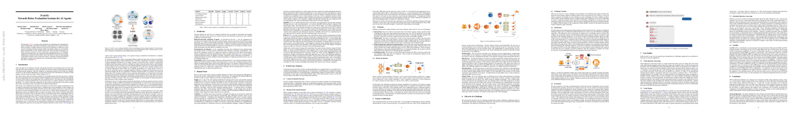

<p align="center"></p>

------------------------------------------------------------------------------------------

[](https://gitter.im/Cloud-CV/EvalAI?utm_source=badge&utm_medium=badge&utm_campaign=pr-badge&utm_content=badge)
[](https://travis-ci.org/Cloud-CV/EvalAI)
[](https://codecov.io/gh/Cloud-CV/EvalAI)
[](https://coveralls.io/github/Cloud-CV/EvalAI)
[](https://github.com/psf/black)
[](https://codeclimate.com/github/Cloud-CV/EvalAI)
[](http://evalai.readthedocs.io/en/latest/)
[](https://twitter.com/eval_ai)

EvalAI is an open source platform for evaluating and comparing machine learning (ML) and artificial intelligence (AI) algorithms at scale.

In recent years, it has become increasingly difficult to compare an algorithm solving a given task with other existing approaches. These comparisons suffer from minor differences in algorithm implementation, use of non-standard dataset splits and different evaluation metrics. By providing a central leaderboard and submission interface, we make it easier for researchers to reproduce the results mentioned in the paper and perform reliable & accurate quantitative analysis. By providing swift and robust backends based on map-reduce frameworks that speed up evaluation on the fly, EvalAI aims to make it easier for researchers to reproduce results from technical papers and perform reliable and accurate analyses.

## Features

- **Custom evaluation protocols and phases**: We allow creation of an arbitrary number of evaluation phases and dataset splits, compatibility using any programming language, and organizing results in both public and private leaderboards.

- **Remote evaluation**: Certain large-scale challenges need special compute capabilities for evaluation. If the challenge needs extra computational power, challenge organizers can easily add their own cluster of worker nodes to process participant submissions while we take care of hosting the challenge, handling user submissions, and maintaining the leaderboard.

- **Evaluation inside environments**: EvalAI lets participants submit code for their agent in the form of docker images which are evaluated against test environments on the evaluation server. During evaluation, the worker fetches the image, test environment, and the model snapshot and spins up a new container to perform evaluation.

- **CLI support**: [evalai-cli](https://github.com/Cloud-CV/evalai-cli) is designed to extend the functionality of the EvalAI web application to your command line to make the platform more accessible and terminal-friendly.

- **Portability**: EvalAI is designed with keeping in mind scalability and portability of such a system from the very inception of the idea. Most of the components rely heavily on open-source technologies – Docker, Django, Node.js, and PostgreSQL.

- **Faster evaluation**: We warm-up the worker nodes at start-up by importing the challenge code and pre-loading the dataset in memory. We also split the dataset into small chunks that are simultaneously evaluated on multiple cores. These simple tricks result in faster evaluation and reduces the evaluation time by an order of magnitude in some cases.

## Goal

Our ultimate goal is to build a centralized platform to host, participate and collaborate in AI challenges organized around the globe and we hope to help in benchmarking progress in AI.

## Installation instructions

Setting up EvalAI on your local machine is really easy. You can setup EvalAI using docker:
The steps are:

1. Install [docker](https://docs.docker.com/install/) and [docker-compose](https://docs.docker.com/compose/install/) on your machine.

2. Get the source code on to your machine via git.

    ```shell
    git clone https://github.com/Cloud-CV/EvalAI.git evalai && cd evalai
    ```

3. Build and run the Docker containers. This might take a while.

    ```
    docker-compose up --build
    ```

4. That's it. Open web browser and hit the URL [http://127.0.0.1:8888](http://127.0.0.1:8888). Three users will be created by default which are listed below -

    **SUPERUSER-** username: `admin` password: `password`  
    **HOST USER-** username: `host` password: `password`  
    **PARTICIPANT USER-** username: `participant` password: `password`

If you are facing any issue during installation, please see our [common errors during installation](https://evalai.readthedocs.io/en/latest/faq(developers).html#common-errors-during-installation) page.

## Citing EvalAI
If you are using EvalAI for hosting challenges, please cite the following technical report:

```
@article{EvalAI,
    title   =  {EvalAI: Towards Better Evaluation Systems for AI Agents},
    author  =  {Deshraj Yadav and Rishabh Jain and Harsh Agrawal and Prithvijit
                Chattopadhyay and Taranjeet Singh and Akash Jain and Shiv Baran
                Singh and Stefan Lee and Dhruv Batra},
    year    =  {2019},
    volume  =  arXiv:1902.03570
}
```
<p>
    <a href="http://learningsys.org/sosp19/assets/papers/23_CameraReadySubmission_EvalAI_SOSP_2019%20(8)%20(1).pdf"></a>
</p>

## Team

EvalAI is currently maintained by [Rishabh Jain](https://rishabhjain.xyz/), [Gunjan Chhablani](https://gchhablani.github.io/) . A non-exhaustive list of other major contributors includes: [Deshraj Yadav](http://deshraj.xyz/), [Ram Ramrakhya](https://ram81.github.io/),[Akash Jain](http://www.jainakash.in/), [Taranjeet Singh](https://taranjeet.cc/), [Shiv Baran Singh](https://github.com/spyshiv), [Harsh Agarwal](https://dexter1691.github.io/), [Prithvijit Chattopadhyay](https://prithv1.github.io/), [Devi Parikh](https://www.cc.gatech.edu/~parikh/) and [Dhruv Batra](https://www.cc.gatech.edu/~dbatra/).

## Contribution guidelines

If you are interested in contributing to EvalAI, follow our [contribution guidelines](https://github.com/Cloud-CV/EvalAI/blob/master/.github/CONTRIBUTING.md).


## Contributors

[//]: contributor-faces
<a href="https://github.com/RishabhJain2018"></a>
<a href="https://github.com/deshraj"></a>
<a href="https://github.com/Ram81"></a>
<a href="https://github.com/taranjeet"></a>
<a href="https://github.com/Sanji515"></a>
<a href="https://github.com/aka-jain"></a>
<a href="https://github.com/Kajol-Kumari"></a>
<a href="https://github.com/Ayukha"></a>
<a href="https://github.com/spyshiv"></a>
<a href="https://github.com/Arun-Jain"></a>
<a href="https://github.com/vkartik97"></a>
<a href="https://github.com/gautamjajoo"></a>
<a href="https://github.com/KhalidRmb"></a>
<a href="https://github.com/guyandtheworld"></a>
<a href="https://github.com/anweshknayak"></a>
<a href="https://github.com/sanketbansal"></a>
<a href="https://github.com/live-wire"></a>
<a href="https://github.com/gauthamzz"></a>
<a href="https://github.com/HargovindArora"></a>
<a href="https://github.com/parismita"></a>
<a href="https://github.com/dexter1691"></a>
<a href="https://github.com/harshithdwivedi"></a>
<a href="https://github.com/nikochiko"></a>
<a href="https://github.com/jayndu"></a>
<a href="https://github.com/matsujika"></a>
<a href="https://github.com/xamfy"></a>
<a href="https://github.com/drepram"></a>
<a href="https://github.com/yadavankit"></a>
<a href="https://github.com/MarchingVoxels"></a>
<a href="https://github.com/sachinmukherjee"></a>
<a href="https://github.com/kurianbenoy"></a>
<a href="https://github.com/mayank-agarwal-96"></a>
<a href="https://github.com/codervivek"></a>
<a href="https://github.com/yashdusing"></a>
<a href="https://github.com/jayantsa"></a>
<a href="https://github.com/itaditya"></a>
<a href="https://github.com/geekayush"></a>
<a href="https://github.com/namansood"></a>
<a href="https://github.com/ParthS007"></a>
<a href="https://github.com/varunagrawal"></a>
<a href="https://github.com/pavan-simplr"></a>
<a href="https://github.com/aayusharora"></a>
<a href="https://github.com/AnshulBasia"></a>
<a href="https://github.com/burnerlee"></a>
<a href="https://github.com/cwiggs"></a>
<a href="https://github.com/tawAsh1"></a>
<a href="https://github.com/nagpalm7"></a>
<a href="https://github.com/parth-verma"></a>
<a href="https://github.com/sarthak212"></a>
<a href="https://github.com/Curious72"></a>
<a href="https://github.com/souravsingh"></a>
<a href="https://github.com/Suryansh5545"></a>
<a href="https://github.com/viditjain08"></a>
<a href="https://github.com/dhruvbatra"></a>
<a href="https://github.com/sehgalayush1"></a>
<a href="https://github.com/Abhi58"></a>
<a href="https://github.com/adamstafa"></a>
<a href="https://github.com/S-ulphuric"></a>
<a href="https://github.com/AliMirlou"></a>
<a href="https://github.com/Aliraza3997"></a>
<a href="https://github.com/amanex007"></a>
<a href="https://github.com/anigasan"></a>
<a href="https://github.com/thisisashukla"></a>
<a href="https://github.com/anuyog1004"></a>
<a href="https://github.com/artkorenev"></a>
<a href="https://github.com/Avikam03"></a>
<a href="https://github.com/makoscafee"></a>
<a href="https://github.com/brunowego"></a>
<a href="https://github.com/calenrobinette"></a>
<a href="https://github.com/galipremsagar"></a>
<a href="https://github.com/GauravJain98"></a>
<a href="https://github.com/hizkifw"></a>
<a href="https://github.com/kakshay21"></a>
<a href="https://github.com/kaansan"></a>
<a href="https://github.com/lenniezelk"></a>
<a href="https://github.com/Marlysson"></a>
<a href="https://github.com/Mateusz1223"></a>
<a href="https://github.com/Mike-Dai"></a>
<a href="https://github.com/zurda"></a>
<a href="https://github.com/namish800"></a>
<a href="https://github.com/neeraj12121"></a>
<a href="https://github.com/n-bernat"></a>
<a href="https://github.com/inishchith"></a>
<a href="https://github.com/radiohazard-dev"></a>
<a href="https://github.com/Shashi456"></a>
<a href="https://github.com/Plebtato"></a>
<a href="https://github.com/pohzipohzi"></a>
<a href="https://github.com/prajwalgatti"></a>
<a href="https://github.com/pushkalkatara"></a>
<a href="https://github.com/Rishav09"></a>
<a href="https://github.com/rshrc"></a>
<a href="https://github.com/rlee80"></a>
<a href="https://github.com/sanyamdogra"></a>
<a href="https://github.com/sayamkanwar"></a>
<a href="https://github.com/shakeelsamsu"></a>
<a href="https://github.com/shiv6146"></a>
<a href="https://github.com/bosecodes"></a>
<a href="https://github.com/tashachin"></a>
<a href="https://github.com/gitter-badger"></a>

[//]: contributor-faces
