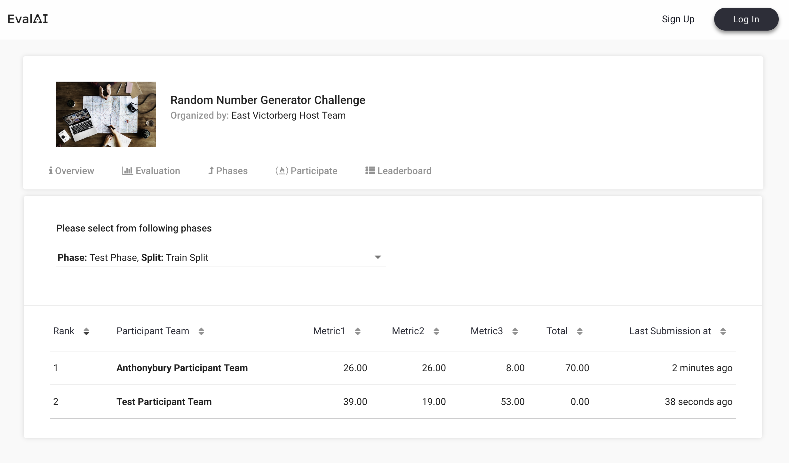

# Challenge Configuration

Following fields are required (and can be customized) in the [`challenge_config.yml`](https://github.com/Cloud-CV/EvalAI-Starters/blob/master/challenge_config.yaml).

- **title**: Title of the challenge

- **short_description**: Short description of the challenge (preferably 140 characters max)

- **description**: Long description of the challenge (use a relative path for the HTML file, e.g. `templates/description.html`)

- **evaluation_details**: Evaluation details and details of the challenge (use a relative path for the HTML file, e.g. `templates/evaluation_details.html`)

- **terms_and_conditions**: Terms and conditions of the challenge (use a relative path for the HTML file, e.g. `templates/terms_and_conditions.html`)

- **image**: Logo of the challenge (use a relative path for the logo in the zip configuration, e.g. `images/logo/challenge_logo.jpg`). **Note**: The image must be in jpg, jpeg or png format.

- **submission_guidelines**: Submission guidelines of the challenge (use a relative path for the HTML file, e.g. `templates/submission_guidelines.html`)

- **evaluation_script**: Python script which will decide how to evaluate submissions in different phases (path of the evaluation script file or folder relative to this YAML file. For e.g. `evaluation_script/`)

- **remote_evaluation**: True/False (specify whether evaluation will happen on a remote machine or not. Default is `False`)

- **start_date**: Start DateTime of the challenge (Format: YYYY-MM-DD HH:MM:SS, e.g. 2017-07-07 10:10:10) in `UTC` time zone

- **end_date**: End DateTime of the challenge (Format: YYYY-MM-DD HH:MM:SS, e.g. 2017-07-07 10:10:10) in `UTC` time zone

- **published**: True/False (Boolean field that gives the flexibility to publish the challenge once approved by EvalAI admin. Default is `False`)

- **tags**: A list of tags to display the relevant areas of challenge. 

- **domain**: Please choose the relevant domain for your challenge: (CV, NLP, RL, MM, AL, TAB).

- **allowed_email_domains**: A list of domains allowed to participate in the challenge. Leave blank if everyone is allowed to participate. (e.g. `["domain1.com", "domain2.org", "domain3.in"]` Participants with these email domains will only be allowed to participate.)

- **blocked_emails_domains**: A list of domains not allowed to participate in the challenge. Leave blank if everyone is allowed to participate. (e.g. `["domain1.com", "domain2.org", "domain3.in"]` Participants with these email domains will not be allowed to participate.)

- **leaderboard**:
  A leaderboard for a challenge on EvalAI consists of following subfields:

  - **id**: Unique positive integer field for each leaderboard entry

  - **schema**: Schema field contains the information about the rows of the leaderboard. A schema contains two keys in the leaderboard:

    1. `labels`: Labels are the header rows in the leaderboard according to which the challenge ranking is done.

    2. `default_order_by`: This key decides the default sorting of the leaderboard based on one of the labels defined above.
    
    3. `metadata`: This field defines additional information about the metrics that are used to evaluate the challenge submissions.

  The leaderboard schema for the [sample challenge configuration](https://github.com/Cloud-CV/EvalAI-Starters/blob/master/challenge_config.yaml) looks like this:

  ```yaml
  leaderboard:
    - id: 1
      schema:
        {
          "labels": ["Metric1", "Metric2", "Metric3", "Total"],
          "default_order_by": "Total",
          "metadata": {
          "Metric1": {
            "sort_ascending": True,
            "description": "Metric Description",
          }
        }
  ```

  The above leaderboard schema will look something like this on leaderboard UI:

  
