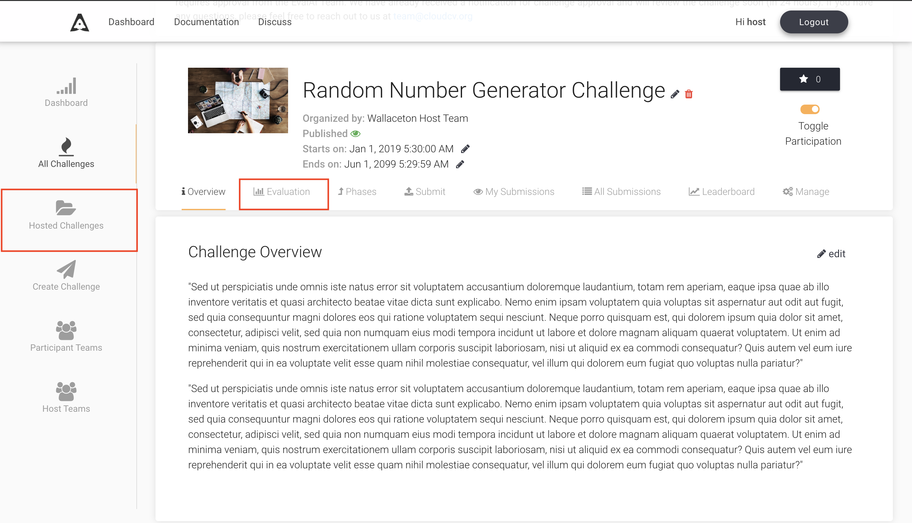
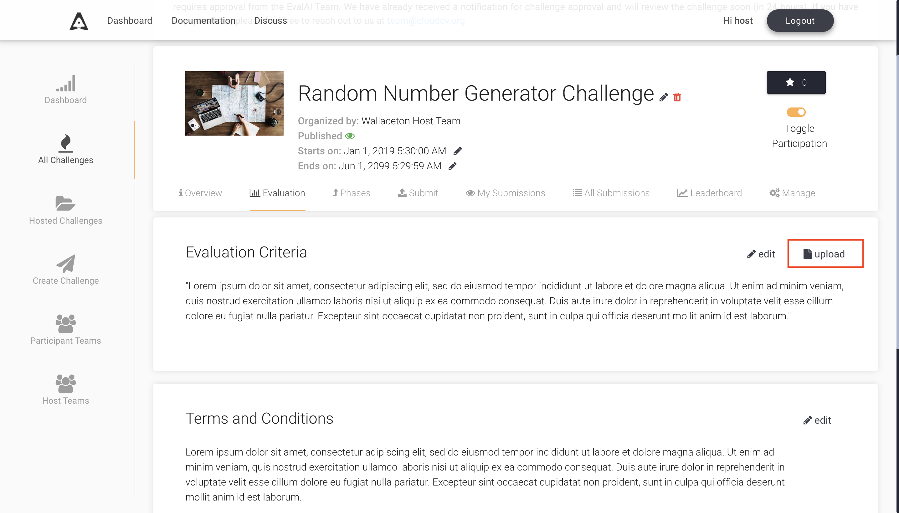

# Evaluation Scripts
Each challenge has an evaluation script, which evaluates the submission of participants and returns the scores which will populate the leaderboard. The logic for evaluating and judging a submission is customizable and varies from challenge to challenge, but the overall structure of evaluation scripts are fixed due to architectural reasons.

## Writing an Evaluation Script

Evaluation scripts are required to have an `evaluate()` function. This is the main function, which is used by workers to evaluate the submission messages.

The syntax of evaluate function is:

```python
def evaluate(test_annotation_file, user_annotation_file, phase_codename, **kwargs):
    pass
```

It receives three arguments, namely:

- `test_annotation_file`: It represents the local path to the annotation file for the challenge. This is the file uploaded by the Challenge host while creating a challenge.

- `user_annotation_file`: It represents the local path of the file submitted by the user for a particular challenge phase.

- `phase_codename`: It is the `codename` of the challenge phase from the [challenge configuration yaml](https://github.com/Cloud-CV/EvalAI-Starters/blob/master/challenge_config.yaml). This is passed as an argument so that the script can take actions according to the challenge phase.

After reading the files, some custom actions can be performed. This varies per challenge.

The `evaluate()` method also accepts keyword arguments. By default, we provide you metadata of each submission to your challenge which you can use to send notifications to your slack channel or to some other webhook service. Following is an example code showing how to get the submission metadata in your evaluation script and send a slack notification if the accuracy is more than some value `X` (X being 90 in the example given below).

```python
def evaluate(test_annotation_file, user_annotation_file, phase_codename, **kwargs):

    submission_metadata = kwargs.get("submission_metadata")
    print submission_metadata

    # Do stuff here
    # Set `score` to 91 as an example

    score = 91
    if score > 90:
        slack_data = kwargs.get("submission_metadata")
        webhook_url = "Your slack webhook url comes here"
        # To know more about slack webhook, checkout this link: https://api.slack.com/incoming-webhooks

        response = requests.post(
            webhook_url,
            data=json.dumps({'text': "*Flag raised for submission:* \n \n" + str(slack_data)}),
            headers={'Content-Type': 'application/json'})

    # Do more stuff here
```

The above example can be modified and used to find if some participant team is cheating or not. There are many more ways for which you can use this metadata.

After all the processing is done, this `evaluate()` should return an output, which is used to populate the leaderboard. The output should be in the following format:

```python
output = {}
output['result'] = [
            {
                'train_split': {
                    'Metric1': 123,
                    'Metric2': 123,
                    'Metric3': 123,
                    'Total': 123,
                }
            },
            {
                'test_split': {
                    'Metric1': 123,
                    'Metric2': 123,
                    'Metric3': 123,
                    'Total': 123,
                }
            }
        ]

return output

```

Let's break down what is happening in the above code snippet.

1. `output` should contain a key named `result`, which is a list containing entries per dataset split that is available for the challenge phase in consideration (in the function definition of `evaluate()` shown above, the argument: `phase_codename` will receive the _codename_ for the challenge phase against which the submission was made).
2. Each entry in the list should be a dict that has a key with the corresponding dataset split codename (`train_split` and `test_split` for this example).
3. Each of these dataset split dict contains various keys (`Metric1`, `Metric2`, `Metric3`, `Total` in this example), which are then displayed as columns in the leaderboard.

## Editing Evaluation Script

Each prediction upload challenge has an evaluation script, which evaluates the submission of participants and returns the scores which will populate the leaderboard. The logic for evaluating a submission is customizable and varies from challenge to challenge.

When setting up a new challenge, hosts need to test multiple versions of evaluation script on EvalAI. To test multiple versions of evaluation script host can update the evaluation script of existing challenge without uploading a whole new challenge configuration.

To edit the evaluation script for existing challenge please follow the following steps:

### 1. Go to the challenge page

Go to hosted challenges and select the challenge to update evaluation script



### 2. Navigate to Evaluation criteria tab

Select the Evaluation criteria tab and click on 'upload' button



### 3. Update the evaluation script

Upload the latest evaluation script and click on 'Submit' button to update the evaluation script


**Tada!** you have successfully updated the evaluation script for a challenge. The evaluation workers for the challenge will be restarted automatically to pick up the latest evaluation script. Please wait for a minimum of 10 minutes for the workers to restart.

