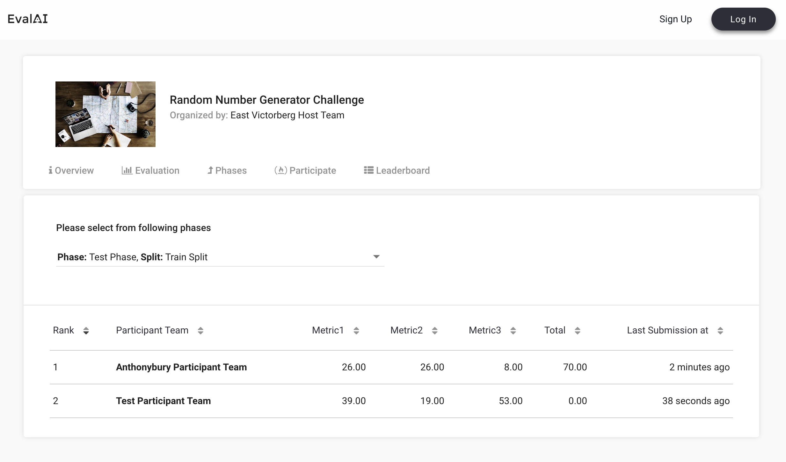

# Metrics and Leaderboards

EvalAI leaderboards display scores returned by your evaluation script. This page explains how to define metrics in `challenge_config.yaml` and how evaluation output maps to leaderboard columns.

For the full challenge configuration reference, see [Challenge Configuration](../configuration/challenge-config.html).

## Leaderboard schema

Each challenge can define one or more leaderboards. A leaderboard entry in `challenge_config.yaml` has:

- **id**: Unique positive integer for each leaderboard.
- **schema**: Defines columns, default sorting, and per-metric metadata.

The schema contains:

1. **labels**: Column headers shown on the leaderboard (for example `Accuracy`, `F1`, `Total`).
2. **default_order_by**: Which label is used for default ranking.
3. **metadata**: Optional settings per metric (sort direction, descriptions).

Example:

```yaml
leaderboard:
  - id: 1
    schema:
      {
        "labels": ["Metric1", "Metric2", "Metric3", "Total"],
        "default_order_by": "Total",
        "metadata": {
          "Metric1": {
            "sort_ascending": true,
            "description": "Metric description shown in the UI"
          }
        }
      }
```



## Evaluation script output format

Your `evaluate()` function must return a dictionary with a `result` key. Each list entry corresponds to a dataset split in the active challenge phase.

```python
output = {}
output["result"] = [
    {
        "train_split": {
            "Metric1": 123,
            "Metric2": 123,
            "Metric3": 123,
            "Total": 123,
        }
    },
    {
        "test_split": {
            "Metric1": 123,
            "Metric2": 123,
            "Metric3": 123,
            "Total": 123,
        }
    },
]
return output
```

Rules:

1. `output` must include `result` as a list.
2. Each list item is a dict keyed by **dataset split codename** (for example `train_split`, `test_split`).
3. Keys inside each split dict become leaderboard columns. They should match the labels in your leaderboard schema.

See [Evaluation Scripts](evaluation-scripts.html) for the full `evaluate()` API.

## Challenge phase splits and visibility

`challenge_phase_splits` connect phases, leaderboards, and dataset splits. Important fields:

| Field | Description |
|-------|-------------|
| `visibility` | Who can see scores: host only (1), host + submitter (2), everyone (3). Default: 3. |
| `leaderboard_decimal_precision` | Decimal places for displayed scores. Default: 2. |
| `is_leaderboard_order_descending` | Sort direction. Set `False` when lower is better (for example error). Default: `True`. |

## Phase-level leaderboard settings

In each `challenge_phases` entry:

- **leaderboard_public**: Whether the phase leaderboard is visible to participants.
- **is_submission_public**: Default submission visibility when the leaderboard is public.

For baseline and public/private submission controls, see [Public Submissions](../../03-for-participants/visibility/public-submissions.html) and [Baseline Submissions](../../03-for-participants/visibility/baseline-submissions.html).
