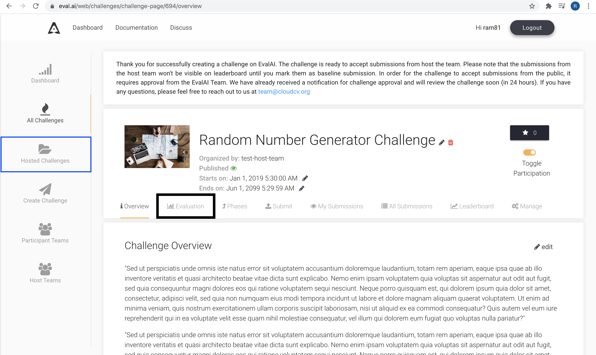
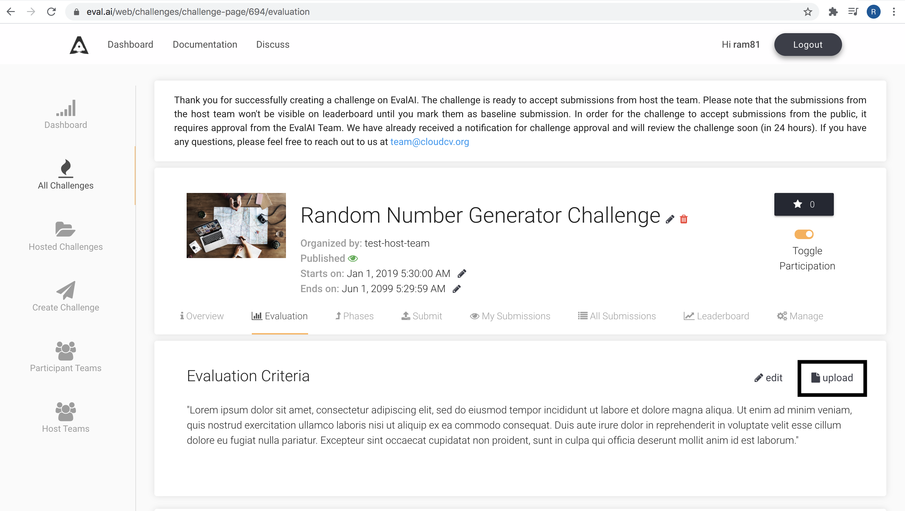
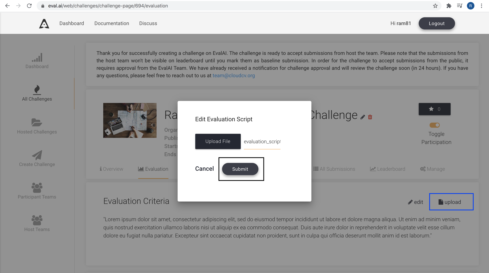

# Prediction Upload Challenges

Prediction upload challenges accept participant result files (JSON, ZIP, CSV, and other allowed types). EvalAI runs your hosted evaluation script on each submission and writes scores to the leaderboard.

This is the default challenge mode when `remote_evaluation` is `false`.

## Overview

1. Participants upload prediction files through the EvalAI UI or [EvalAI CLI](https://cli.eval.ai/).
2. EvalAI queues the submission and runs your `evaluate()` function on EvalAI workers.
3. Returned metrics populate the leaderboard defined in `challenge_config.yaml`.

See [Evaluation Scripts](evaluation-scripts.html) for writing `evaluate()` and [Metrics and Leaderboards](metrics-leaderboards.html) for output format.

## Challenge configuration

Set `remote_evaluation: false` (default) in `challenge_config.yaml`. Point `evaluation_script` to your zipped evaluation code.

Configure allowed file types per phase with `allowed_submission_file_types`, for example:

```yaml
allowed_submission_file_types: ".json, .zip"
```

## Updating the evaluation script

After a challenge is created, you can upload a new evaluation script without re-uploading the entire challenge bundle.

1. Open your challenge on EvalAI and go to **Hosted Challenges**.
2. Open the **Evaluation criteria** tab.
3. Upload the updated evaluation script ZIP and submit.







Workers restart automatically to load the new script. Allow at least 10 minutes for workers to pick up changes.

## Editing via GitHub (recommended)

If the challenge is linked to [EvalAI-Starters](https://github.com/Cloud-CV/EvalAI-Starters), push changes to the `challenge` branch so GitHub Actions syncs configuration and evaluation files. See [Getting Started with Hosting](../hosting-guide/getting-started.html).

## Remote evaluation alternative

If you need to run evaluation on your own infrastructure (GPUs, custom dependencies, air-gapped environments), enable `remote_evaluation: true` and follow [Remote Evaluation](remote-evaluation.html).
