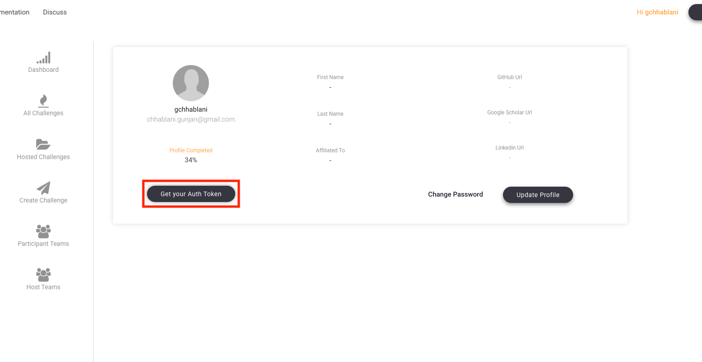
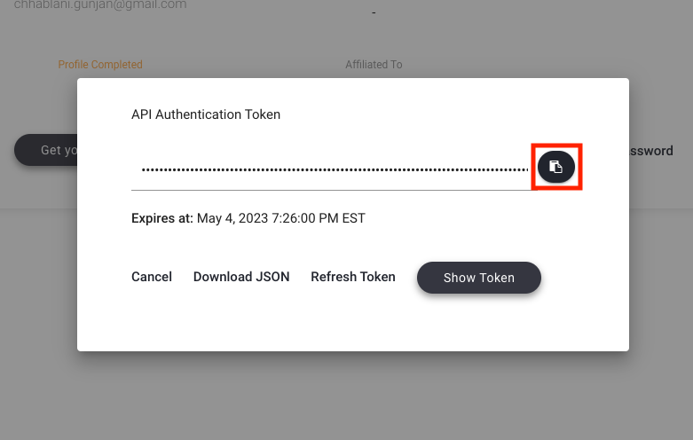
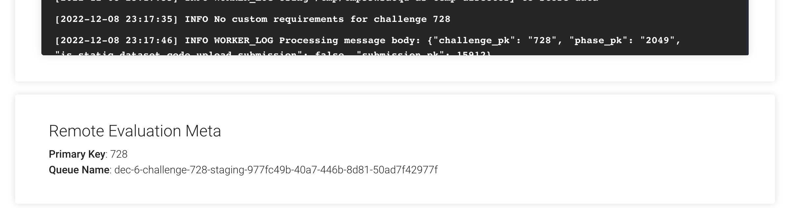

# Remote Evaluation

Remote evaluation lets challenge hosts run `evaluate()` on their own machines while EvalAI handles submissions, queuing, and leaderboards.

Each challenge still uses an evaluation script, but a **remote worker** you operate pulls submissions from EvalAI and returns scores.

## When to use remote evaluation

Use remote evaluation when you need:

- Custom hardware (GPUs, large memory, proprietary tooling)
- Evaluation code that cannot run on EvalAI workers
- Full control over the evaluation environment

Set `remote_evaluation: true` in `challenge_config.yaml`. See [Host a remote evaluation challenge](../hosting-guide/host-challenge.html#host-a-remote-evaluation-challenge) for the hosting workflow.

## Starter template

The remote evaluation starter lives in [EvalAI-Starters/remote_challenge_evaluation](https://github.com/Cloud-CV/EvalAI-Starters/tree/master/remote_challenge_evaluation).

## Setup environment variables

Configure authentication and challenge metadata before starting the worker:

| Variable | Description |
|----------|-------------|
| `AUTH_TOKEN` | From [EvalAI profile](https://eval.ai/web/profile) → **Get your Auth Token** → copy. |
| `API_SERVER` | `https://eval.ai` (production) or `https://staging.eval.ai` (staging). |
| `QUEUE_NAME` | Challenge queue name from the challenge **Manage** tab. |
| `CHALLENGE_PK` | Challenge primary key from the **Manage** tab. |
| `SAVE_DIR` | Optional local path to store downloaded submission files. |







## Write the `evaluate` method

Remote evaluation scripts must define `evaluate()`:

```python
def evaluate(user_submission_file, phase_codename, test_annotation_file=None, **kwargs):
    # Load predictions, compute metrics, return leaderboard output
    pass
```

Arguments:

- **user_submission_file**: Local path to the participant submission file.
- **phase_codename**: Phase codename from `challenge_config.yaml`; use it to branch logic per phase.
- **test_annotation_file**: Local path to the host-uploaded annotation file for the phase (optional in signature; can be passed from `main.py`).

The function may accept additional `**kwargs` (for example submission metadata for Slack or webhooks).

**Important:** If evaluation fails, raise an `Exception` with a clear message so the submission is marked failed and the participant sees useful feedback.

Return format matches standard challenges — see [Metrics and Leaderboards](metrics-leaderboards.html).

## Run the remote evaluation worker

1. Create a conda or virtual environment ([conda environments guide](https://docs.conda.io/projects/conda/en/latest/user-guide/tasks/manage-environments.html#creating-an-environment-with-commands)).

2. Install dependencies:

   ```bash
   cd EvalAI-Starters
   pip install -r remote_challenge_evaluation/requirements.txt
   ```

3. Set the environment variables from the table above.

4. Start the worker:

   ```bash
   cd EvalAI-Starters/remote_challenge_evaluation
   python main.py
   ```

Keep the worker running while the challenge is active so submissions are processed promptly.

## Related documentation

- [Prediction Upload Challenges](prediction-upload.html) — hosted evaluation on EvalAI workers
- [Evaluation Scripts](evaluation-scripts.html) — `evaluate()` output format
- [Remote Evaluation example](../../06-examples-tutorials/host-examples/remote-evaluation.html) — condensed end-to-end walkthrough

For help, contact [team@eval.ai](mailto:team@eval.ai) or open a [GitHub issue](https://github.com/Cloud-CV/EvalAI/issues/new).
