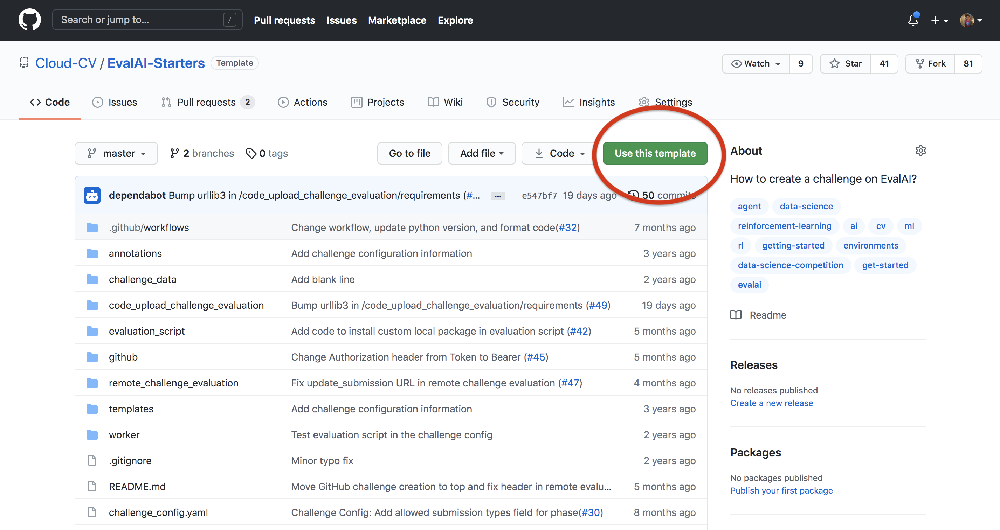
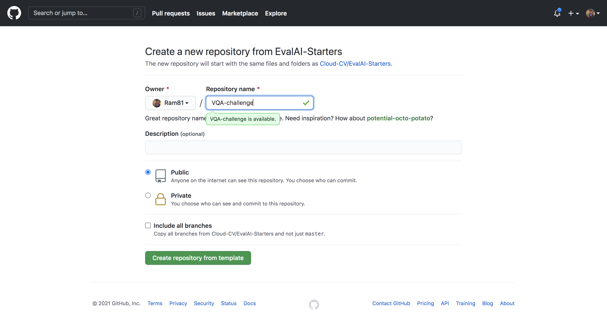
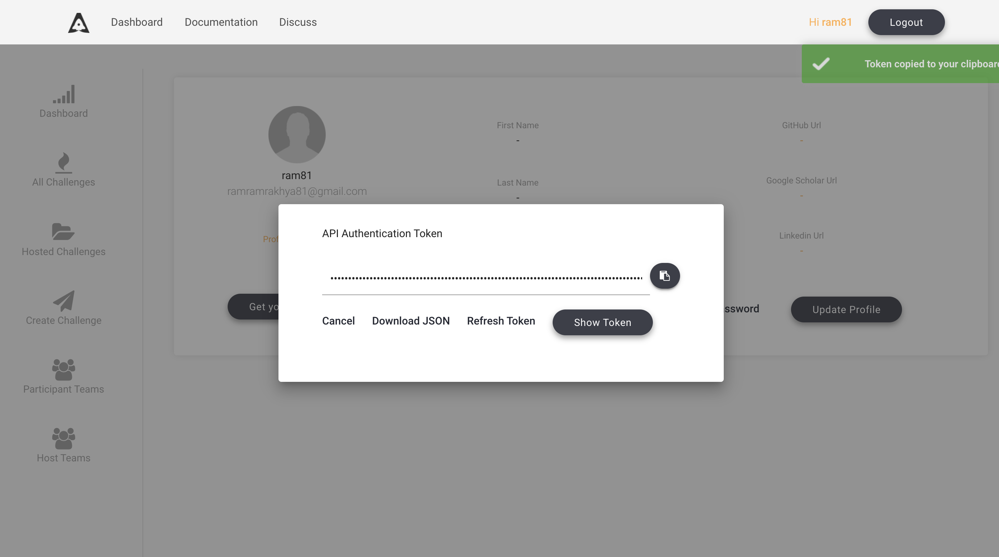
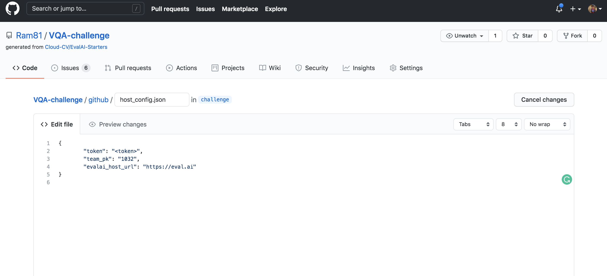
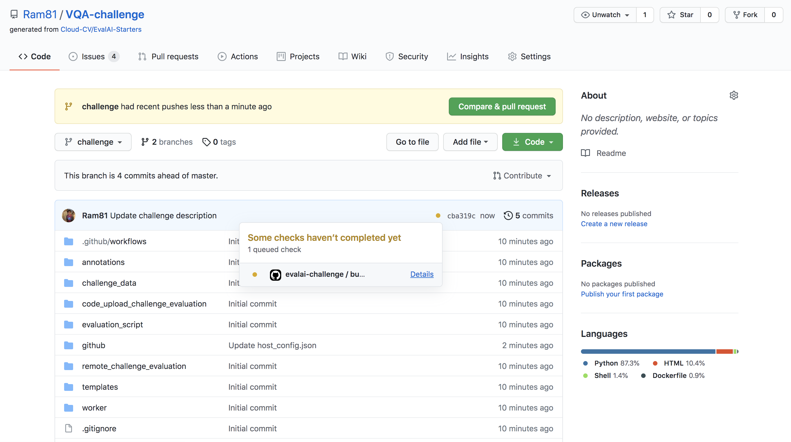
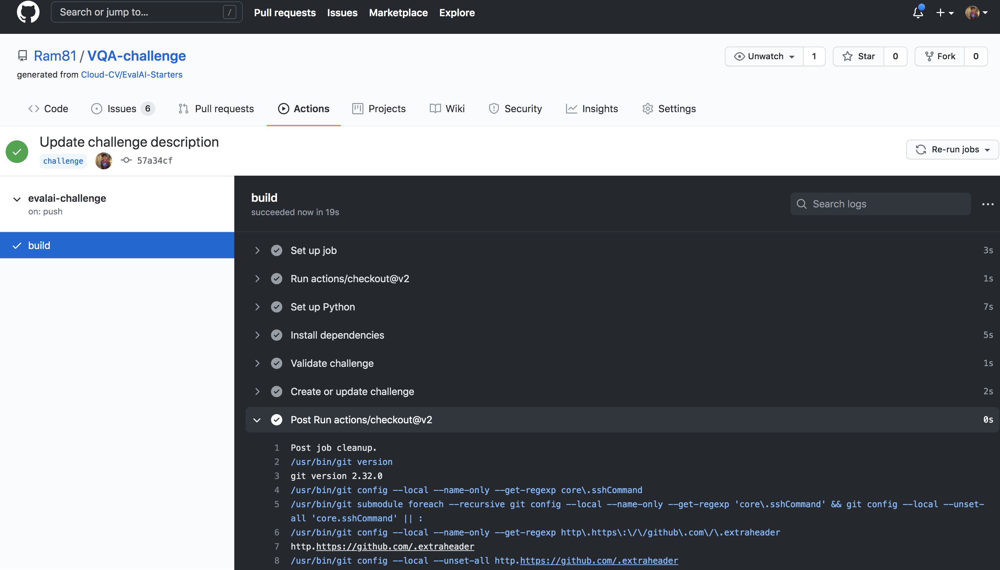

# Getting Started as a Challenge Host

This guide walks through creating a challenge on EvalAI using the GitHub-based workflow.

## Prerequisites

- EvalAI account at [eval.ai](https://eval.ai)
- A [challenge host team](https://eval.ai/web/challenge-host-teams)
- GitHub account

## Step 1: Create a repository from EvalAI-Starters

1. Open [EvalAI-Starters](https://github.com/Cloud-CV/EvalAI-Starters) and click **Use this template** to create your repository. See [GitHub: creating from a template](https://docs.github.com/en/repositories/creating-and-managing-repositories/creating-a-repository-from-a-template).

   

   

## Step 2: Configure GitHub secrets

1. Create a [GitHub personal access token](https://docs.github.com/en/authentication/keeping-your-account-and-data-secure/creating-a-personal-access-token).
2. In your fork, add a repository secret named `AUTH_TOKEN` with that token.

## Step 3: Collect EvalAI credentials

On [EvalAI](https://eval.ai):

1. **evalai_user_auth_token** — [Profile](https://eval.ai/web/profile) → **Get your Auth Token** → copy.
2. **host_team_pk** — [Host teams](https://eval.ai/web/challenge-host-teams) → copy the team **ID**.
3. **evalai_host_url** — `https://eval.ai` (production) or `https://staging.eval.ai` (staging).

## Step 4: Use the `challenge` branch

Create a branch named `challenge` from `master`. **Only commits on `challenge` sync to EvalAI.**

Add `evalai_user_auth_token` and `host_team_pk` to `github/host_config.json`:

## Step 5: Configure the challenge

Edit `challenge_config.yaml`, HTML templates, and the evaluation script. See:

- [Challenge Configuration](../configuration/challenge-config.html)
- [HTML Templates](../templates/html-templates.html)
- [Evaluation](../evaluation/index.html)

## Step 6: Push and verify the build

Commit and push to `challenge`. Watch [GitHub Actions logs](https://docs.github.com/en/actions/monitoring-and-troubleshooting-workflows/using-workflow-run-logs).

- If the config has errors, GitHub opens an issue in your repo with details.
- If the build succeeds, the challenge appears under [Hosted Challenges](https://eval.ai/web/hosted-challenges).

## Step 7: Approval

On [eval.ai](https://eval.ai), the [EvalAI team](https://eval.ai/team) approves new challenges. Self-hosted forks can approve via Django admin — see [Approval Process](approval-process.html).

## Next steps

- [Challenge examples with EvalAI-Starters](../../06-examples-tutorials/evalai-starters-guide.html) — map the template repo to common challenge patterns
- [Host a Challenge](host-challenge.html) — full hosting walkthrough
- [Remote evaluation](../evaluation/remote-evaluation.html) — run workers on your infrastructure
- [Example challenge configs](../templates/example-challenges.html)
