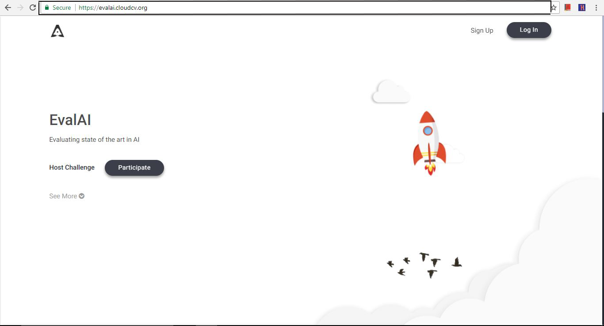
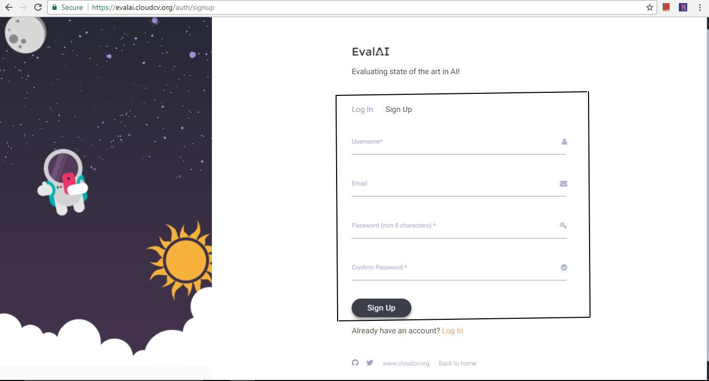
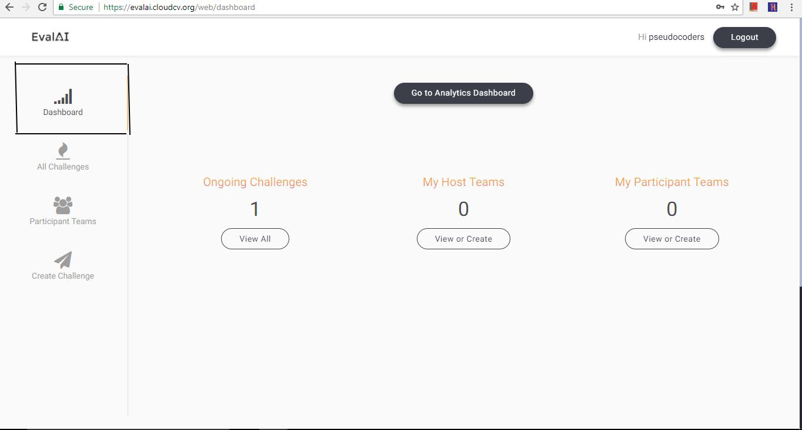
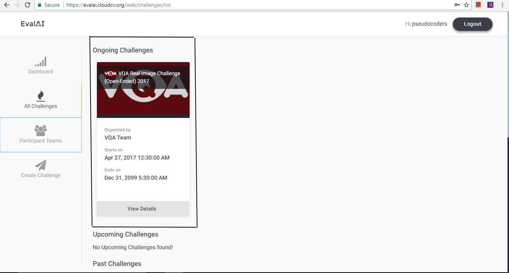
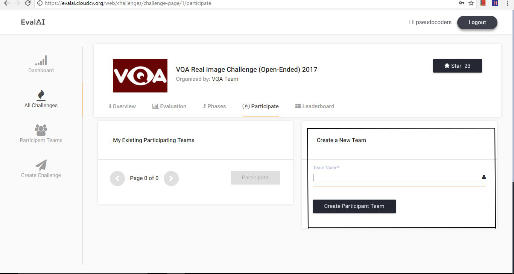
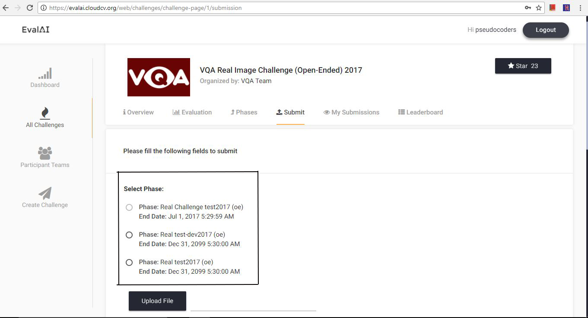

# Getting Started as a Participant

To compete in an EvalAI challenge you need an account and a participant team.

## Step 1: Visit EvalAI

Open [https://eval.ai](https://eval.ai).

## Step 2: Sign up or log in

Create an account or log in with existing credentials.

After sign-up you land on the dashboard.

## Step 3: Choose a challenge

Browse **Challenges** and open an active challenge.

## Step 4: Read the challenge page

Review instructions, phases, deadlines, and submission rules on the challenge overview.

## Step 5: Create or select a participant team

Create a new participant team or choose an existing one. Teams let multiple users submit under one name.

## Step 6: Participate

Open the **Participate** tab after selecting your team.

You can now submit to open phases.

## Next steps

- [Team Management](team-management.html)
- [Making your first submission](../../06-examples-tutorials/participant-examples/first-submission.html)
- [EvalAI CLI](../cli-tools/evalai-cli.html) for terminal-based submissions
