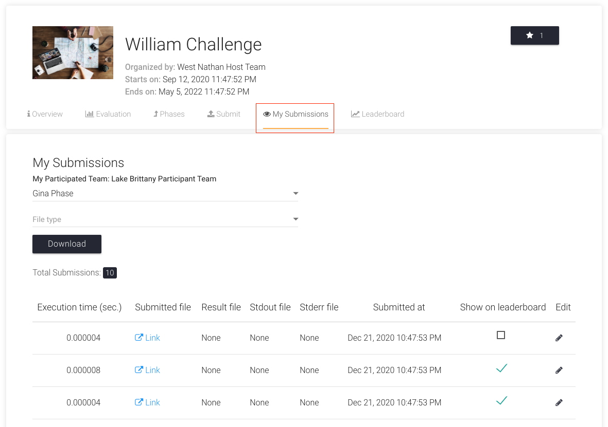

# Private Submissions

Let's assume that you want to make your latest submission private in `William Challenge`.

1. Go to `My Submissions` Tab of the challenge page, select the phase and scroll horizontally.
   

2. Now, to make the first submission private, click on the green checkmark under the column `Show on Leaderboard`. It will turn into a black checkbox.
   
   

If you face any issues, please feel free to create an issue on our [GitHub Issues Page](https://github.com/Cloud-CV/EvalAI/issues/new).
