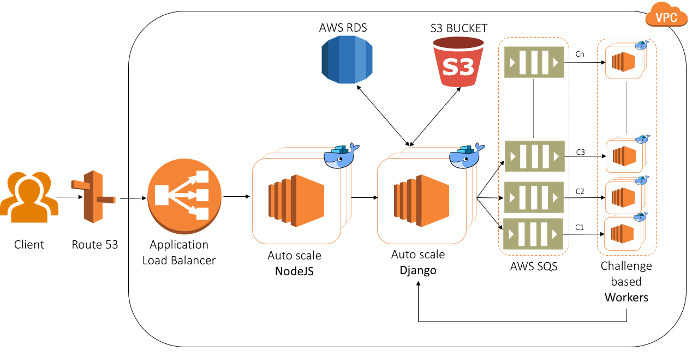

# Technology Stack

EvalAI is an open platform for hosting AI challenges. The stack combines a Django API, AngularJS frontend, queue-based workers, and PostgreSQL storage.

## Backend

### Django

Django powers the core web application and admin interfaces.

### Django REST Framework

REST APIs expose challenges, submissions, leaderboards, and accounts. Serializers and permissions keep endpoints consistent across apps.

## Data and messaging

### PostgreSQL

Primary database for challenges, users, submissions, and leaderboard data.

### Amazon SQS

Submission messages are published to SQS (or compatible queues in development). Workers consume messages and run evaluation scripts.

## Frontend

### AngularJS

The participant and host dashboards use AngularJS in the `frontend/` directory.

## Workers

Python workers under `scripts/workers/` process submissions:

- `submission_worker.py` — standard hosted evaluation
- `remote_submission_worker.py` — coordination for remote evaluation
- `code_upload_submission_worker.py` — environment-based challenges

## See also

- [Directory structure](../architecture/index.html) — app layout
- [Worker setup](../deployment/worker-setup.html)
- [Contribution guide](../contributing/contribution-guide.html)
