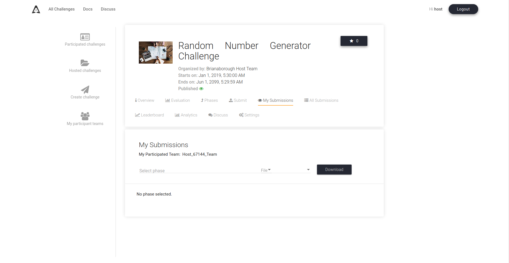
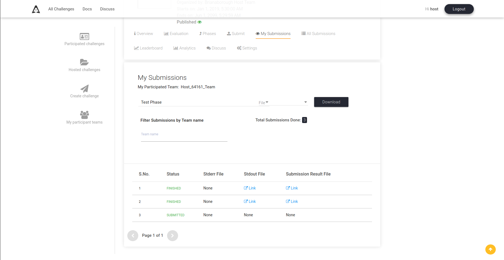
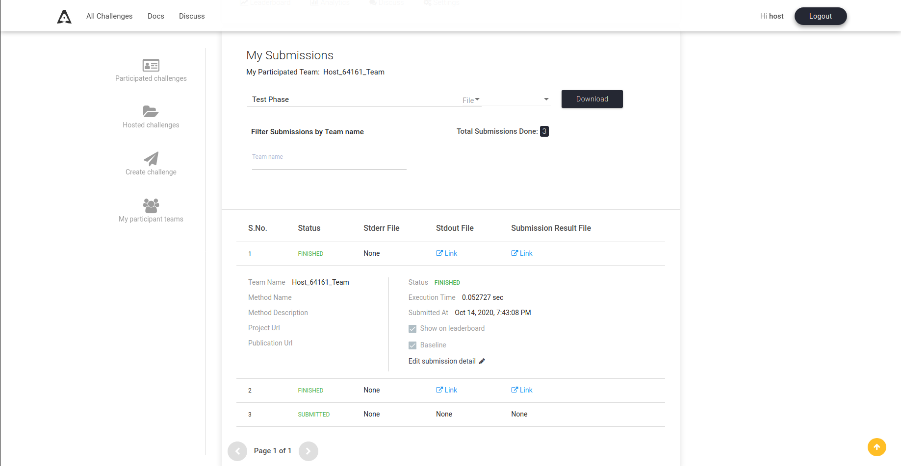

# Make a submission baseline

The submissions of the challenge hosts don't appear until they are made as a baseline, to make a submission baseline follow the steps below.

Let's assume that we are hosting a challenge with the name `Random Number Generator Challenge`.

### Step 1 : Head to your challenge page and click on My Submissions tab.

  

### Step 2 : Select the challenge phase to see your submissions for that phase.

  

### Step 3 : Click on the submission to display more details about the submission. Click on the baseline checkbox to make/remove a submission as baseline.

  
