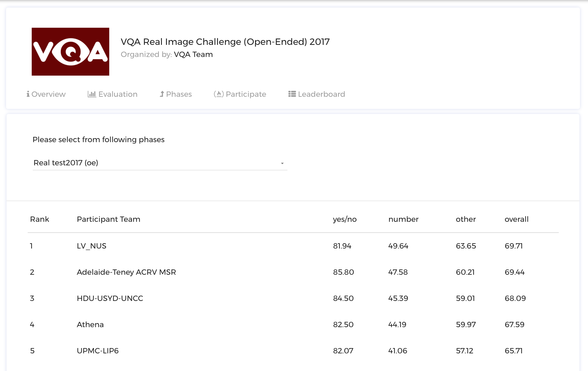

# Creating a Challenge

One can create a challenge in EvalAI using either:

1. zip configuration
2. web interface

## Challenge creation using zip configuration

### Getting Started

Creating a challenge on EvalAI is a three-step process. You just need to upload the challenge details in a challenge configuration file (**YAML file**) and we will take care of the rest.

The challenge configuration file on EvalAI consists of following fields:

* **title**: Title of the challenge

* **short_description**: Short description of the challenge (preferably 140 characters max)

* **description**: Long description of the challenge (use a relative path for the html file, e.g. `challenge_details/description.html`)

* **evaluation_criteria**: Evaluation criteria and details of the challenge (use a relative path for the html file, e.g. `challenge_details/evaluation.html`)

* **terms_and_conditions**: Terms and conditions of the challenge (use a relative path for the html file, e.g. `challenge_details/tnc.html`)

* **image**: Logo of the challenge (use a relative path for the logo in the zip configuration, e.g. `images/logo/challenge_logo.jpg`). **Note**: The image must be in jpg, jpeg or png format.

* **submission_guidelines**: Submission guidelines of the challenge (use a relative path for the html file, e.g. `challenge_details/submission_guidelines.html`)

* **evaluation_script**: The evaluation script using which the submissions will be evaluated (path of the evaluation script file or folder relative to this YAML file.)

* **start_date**: Start DateTime of the challenge (Format: YYYY-MM-DD HH:MM:SS, e.g. 2017-07-07 10:10:10)

* **end_date**: End DateTime of the challenge (Format: YYYY-MM-DD HH:MM:SS, e.g. 2017-07-07 10:10:10)

* **published**: True/False (Boolean field that gives the flexibility to publish the challenge once approved by EvalAI Admin. Default is `False`)


* **leaderboard**:

  A leaderboard for a challenge on EvalAI consists of following subfields:

  * **id**: Unique integer field for each leaderboard entry

  * **schema**: Schema field contains the information about the rows of the leaderboard. Schema contains two keys in the leaderboard:

  1. `labels`: Labels are the header rows in the leaderboard according to which the challenge ranking is done.

  2. `default_order_by`: This key decides the default sorting of the leaderboard based on one of the labels defined above.

  The leaderboard schema for VQA Challenge 2017 looks something like this:

  ```
    {
      "labels": ["yes/no", "number", "others", "overall"],
      "default_order_by": "overall"
    }
  ```

  The above schema of leaderboard for VQA Challenge creates the leaderboard web interface like this:

  


* **challenge_phases**:

  There can be multiple challenge phases in a challenge. A challenge phase in a challenge contains the following subfields:

    * **id**: Unique integer identifier for the challenge phase

    * **name**: Name of the challenge phase

    * **description**: Long description of the challenge phase (set relative path of the html file, e.g. `challenge_details/phase1_description.html`)

    * **leaderboard_public**: True/False (Boolean field that gives the flexibility to Challenge Hosts to make their leaderboard public or private. Default is `False`)

    * **is_public**: True/False (Boolean field that gives the flexibility to Challenge Hosts to either hide or show the challenge phase to participants. Default is `False`)

    * **start_date**: Start DateTime of the challenge phase (Format: YYYY-MM-DD HH:MM:SS, e.g. 2017-07-07 10:10:10)

    * **end_date**: End DateTime of the challenge phase (Format: YYYY-MM-DD HH:MM:SS, e.g. 2017-07-07 10:10:10)

    * **test_annotation_file**: This file is used for ranking the submission made by a participant. An annotation file can be shared by more than one challenge phase. (Path of the test annotation file relative to this YAML file, e.g. `challenge_details/test_annotation.txt`)

    * **codename**: Challenge phase codename. Note that the codename of a challenge phase is used to map the results returned by the evaluation script to a particular challenge phase. The codename specified here should match with the codename specified in the evaluation script to perfect mapping.

    * **max_submissions_per_day**: Positive integer which tells the maximum number of submissions per day to a challenge phase.

    * **max_submissions**: Positive integer that decides the overall maximum number of submissions that can be done to a challenge phase.


* **dataset_splits**:

  A dataset in EvalAI is the main entity on which an AI challenge is based on. Participants are expected to make submissions corresponding to different splits of the corresponding dataset. A dataset is generally divided into different parts and each part is called dataset split. Generally, a dataset has three different splits:

  1. Training set
  2. Validation set
  3. Test set

  * **id**: Unique integer identifier for the dataset split

  * **name**: Name of the dataset split (it must be unique for every dataset split)

  * **codename**: Codename of dataset split. Note that the codename of a dataset split is used to map the results returned by the evaluation script to a particular dataset split in EvalAI's database. Please make sure that no two dataset splits have the same codename. Again, make sure that the dataset split's codename match with what is in the evaluation script provided by the challenge host.


* **challenge_phase_splits**:

  A challenge phase split is a relation between a challenge phase and dataset splits for a challenge (many to many relation). This is used to set the privacy of submissions (public/private) to different dataset splits for different challenge phases.

  * **challenge_phase_id**: Id of challenge_phase (Gets the challenge phase details to map with)

  * **leaderboard_id**: Id of leaderboard (Given above)

  * **dataset_split_id**: Id of dataset split (Given above)

  * **visibility**: Enter any of the positive integers given below.

    a) HOST -> 1

    b) OWNER AND HOST -> 2

    c) PUBLIC -> 3

### Sample zip configuration file

Here is a sample configuration file for a challenge with 1 phase and 2 dataset split:

```yaml

title: Challenge Title
short_description: Short description of the challenge (preferably 140 characters)
description: description.html
evaluation_details: evaluation_details.html
terms_and_conditions: terms_and_conditions.html
image : logo.jpg
submission_guidelines: submission_guidelines.html
evaluation_script: evaluation_script.zip
start_date: 2017-06-09 20:00:00
end_date: 2017-06-19 20:00:00
published: True

leaderboard:
  - id: 1
    schema: {"labels": ["yes/no", "number", "others", "overall"], "default_order_by": "overall"}
  - id: 2
    schema: {"labels": ["yes/no", "number", "others", "overall"], "default_order_by": "yes/no"}

challenge_phases:
  - id: 1
    name: Challenge name of the challenge phase
    description: challenge_phase_description.html
    leaderboard_public: True
    is_public: True
    start_date: 2017-06-09 20:00:00
    end_date: 2017-06-19 20:00:00
    test_annotation_file: test_annotation.txt
    codename: Challenge phase codename
    max_submissions_per_day: 100
    max_submissions: 1000

dataset_splits:
  - id: 1
    name: Name of the dataset split
    codename: codename of dataset split 1
  - id: 2
    name: Name of the dataset split
    codename: codename of dataset split 2

challenge_phase_splits:
  - challenge_phase_id: 1
    leaderboard_id: 2
    dataset_split_id: 1
    visibility: 3
  - challenge_phase_id: 1
    leaderboard_id: 1
    dataset_split_id: 2
    visibility: 3

```
### Challenge Creation Examples

Please see this [repository](https://github.com/Cloud-CV/EvalAI-Examples) for examples on the different types of challenges on EvalAI.

### Next Steps

The next step is to create a zip file that contains the YAML config file, all the HTML templates for the challenge description, challenge phase description, evaluation criteria, submission guidelines, evaluation script, test annotation file(s) and challenge logo (optional).

The final step is to create a challenge host team for the challenge on EvalAI. After that, just upload the zip folder created in the above steps and the challenge will be created.

If you have issues in creating a challenge on EvalAI, please feel free to create an issue on our Github Issues Page.

## Create challenge using web interface

Todo: We are working on this feature and will keep you updated.
