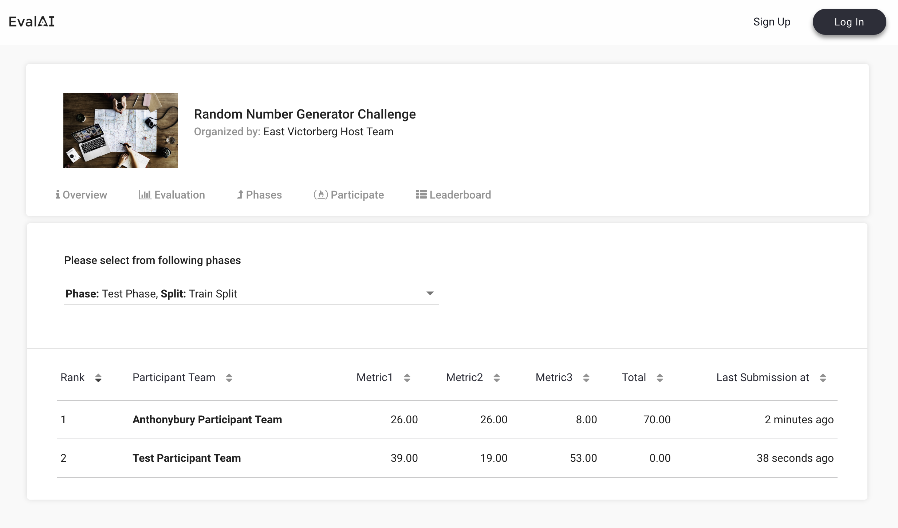

# Challenge configuration

Following fields are required (and can be customized) in the [`challenge_config.yml`](https://github.com/Cloud-CV/EvalAI-Starters/blob/master/challenge_config.yaml).

- **title**: Title of the challenge

- **short_description**: Short description of the challenge (preferably 140 characters max)

- **description**: Long description of the challenge (use a relative path for the HTML file, e.g. `templates/description.html`)

- **evaluation_details**: Evaluation details and details of the challenge (use a relative path for the HTML file, e.g. `templates/evaluation_details.html`)

- **terms_and_conditions**: Terms and conditions of the challenge (use a relative path for the HTML file, e.g. `templates/terms_and_conditions.html`)

- **image**: Logo of the challenge (use a relative path for the logo in the zip configuration, e.g. `images/logo/challenge_logo.jpg`). **Note**: The image must be in jpg, jpeg or png format.

- **submission_guidelines**: Submission guidelines of the challenge (use a relative path for the HTML file, e.g. `templates/submission_guidelines.html`)

- **evaluation_script**: Python script which will decide how to evaluate submissions in different phases (path of the evaluation script file or folder relative to this YAML file. For e.g. `evaluation_script/`)

- **remote_evaluation**: True/False (specify whether evaluation will happen on a remote machine or not. Default is `False`)

- **is_docker_based**: True/False (specify whether the challenge is docker based or not. Default is `False`)

- **is_static_dataset_code_upload**: True/False (specify whether the challenge is static dataset code upload or not. Default is `False`)

- **start_date**: Start DateTime of the challenge (Format: YYYY-MM-DD HH:MM:SS, e.g. 2017-07-07 10:10:10) in `UTC` time zone

- **end_date**: End DateTime of the challenge (Format: YYYY-MM-DD HH:MM:SS, e.g. 2017-07-07 10:10:10) in `UTC` time zone

- **published**: True/False (Boolean field that gives the flexibility to publish the challenge once approved by EvalAI admin. Default is `False`)

- **tags**: A list of tags to display the relevant areas of challenge. 

- **domain**: Please choose the relevant domain for your challenge: (CV, NLP, RL, MM, AL, TAB).

- **allowed_email_domains**: A list of domains allowed to participate in the challenge. Leave blank if everyone is allowed to participate. (e.g. `["domain1.com", "domain2.org", "domain3.in"]` Participants with these email domains will only be allowed to participate.)

- **blocked_emails_domains**: A list of domains not allowed to participate in the challenge. Leave blank if everyone is allowed to participate. (e.g. `["domain1.com", "domain2.org", "domain3.in"]` Participants with these email domains will not be allowed to participate.)

- **leaderboard**:
  A leaderboard for a challenge on EvalAI consists of following subfields:

  - **id**: Unique positive integer field for each leaderboard entry

  - **schema**: Schema field contains the information about the rows of the leaderboard. A schema contains two keys in the leaderboard:

    1. `labels`: Labels are the header rows in the leaderboard according to which the challenge ranking is done.

    2. `default_order_by`: This key decides the default sorting of the leaderboard based on one of the labels defined above.
    
    3. `metadata`: This field defines additional information about the metrics that are used to evaluate the challenge submissions.

  The leaderboard schema for the [sample challenge configuration](https://github.com/Cloud-CV/EvalAI-Starters/blob/master/challenge_config.yaml) looks like this:

  ```yaml
  leaderboard:
    - id: 1
      schema:
        {
          "labels": ["Metric1", "Metric2", "Metric3", "Total"],
          "default_order_by": "Total",
          "metadata": {
          "Metric1": {
            "sort_ascending": True,
            "description": "Metric Description",
          }
        }
  ```

  The above leaderboard schema will look something like this on leaderboard UI:

  

* **challenge_phases**:

  There can be multiple [challenge phases](https://evalai.readthedocs.io/en/latest/glossary.html#challenge-phase) in a challenge. A challenge phase in a challenge contains the following subfields:

  - **id**: Unique integer identifier for the challenge phase

  - **name**: Name of the challenge phase

  - **description**: Long description of the challenge phase (set the relative path of the HTML file, e.g. `templates/challenge_phase_1_description.html`)

  - **leaderboard_public**: True/False (a Boolean field that gives the flexibility to Challenge Hosts to either make the leaderboard public or private. Default is `False`)

  - **is_public**: True/False (a Boolean field that gives the flexibility to Challenge Hosts to either hide or show the challenge phase to participants. Default is `False`)

  - **is_submission_public**: True/False (a Boolean field that gives the flexibility to Challenge Hosts to either make the submissions by default public/private. Note that this will only work when the `leaderboard_public` property is set to true. Default is `False`)

  - **start_date**: Start DateTime of the challenge phase (Format: YYYY-MM-DD HH:MM:SS, e.g. 2017-07-07 10:10:10)

  - **end_date**: End DateTime of the challenge phase (Format: YYYY-MM-DD HH:MM:SS, e.g. 2017-07-07 10:10:10)

  - **test_annotation_file**: This file is used for ranking the submission made by a participant. An annotation file can be shared by more than one challenge phase. (Path of the test annotation file relative to this YAML file, e.g. `annotations/test_annotations_devsplit.json`)

  - **codename**: Unique id for each challenge phase. Note that the codename of a challenge phase is used to map the results returned by the evaluation script to a particular challenge phase. The codename specified here should match with the codename specified in the evaluation script to perfect mapping.

  - **max_submissions_per_day**: A positive integer that tells the maximum number of submissions per day to a challenge phase. (Optional, Default value is `100000`)

  - **max_submissions_per_month**: A positive integer that tells the maximum number of submissions per month to a challenge phase. (Optional, Default value is `100000`)

  - **max_submissions**: A positive integer that decides the maximum number of total submissions that can be made to the challenge phase. (Optional,  Default value is `100000`)

  - **default_submission_meta_attributes**: These are the default metadata attributes that will be displayed for all submissions, the metadata attributes are `method_name`, `method_description`, `project_url`, and `publication_url`.
      ```yaml
    default_submission_meta_attributes:
      - name: method_name
        is_visible: True
      - name: method_description
        is_visible: True
      - name: project_url
        is_visible: True
      - name: publication_url
        is_visible: True
      ```
  - **submission_meta_attributes**: These are the custom metadata attributes that participants can add to their submissions. The custom metadata attributes are `TextAttribute`, `SingleOptionAttribute`, `MultipleChoiceAttribute`, and `TrueFalseField`.
    ```yaml
    submission_meta_attributes:
      - name: TextAttribute
        description: Sample
        type: text
        required: False
      - name: SingleOptionAttribute
        description: Sample
        type: radio
        options: ["A", "B", "C"]
      - name: MultipleChoiceAttribute
        description: Sample
        type: checkbox
        options: ["alpha", "beta", "gamma"]
      - name: TrueFalseField
        description: Sample
        type: boolean
        required: True
    ```
  - **is_restricted_to_select_one_submission**: True/False (indicates whether to restrict a user to select only one submission for the leaderboard. Default is `False`)
  - **is_partial_submission_evaluation_enabled**: True/False (indicates whether partial submission evaluation is enabled. Default is `False`)
  - **allowed_submission_file_types**: This is a list of file types that are allowed for submission (Optional Default is `.json, .zip, .txt, .tsv, .gz, .csv, .h5, .npy`)

- **dataset_splits**:

  Dataset splits define the subset of test-set on which the submissions will be evaluated on. Generally, most challenges have three splits:

  1. **train_split** (Allow participants to make a large number of submissions, let them see how they are doing, and let them overfit)
  2. **test_split** (Allow a small number of submissions so that they cannot mimic test_set. Use this split to decide the winners for the challenge)
  3. **val_split** (Allow participants to make submissions and evaluate on the validation split)

  A dataset split has the following subfields:

  - **id**: Unique integer identifier for the split

  - **name**: Name of the split (it must be unique for every split)

  - **codename**: Unique id for each split. Note that the codename of a dataset split is used to map the results returned by the evaluation script to a particular dataset split in EvalAI's database. Please make sure that no two dataset splits have the same codename. Again, make sure that the dataset split's codename match with what is in the evaluation script provided by the challenge host.

- **challenge_phase_splits**:

  A challenge phase split is a relation between a challenge phase and dataset splits for a challenge (many to many relation). This is used to set the privacy of submissions (public/private) to different dataset splits for different challenge phases.

  - **challenge_phase_id**: Id of `challenge_phase` to map with

  - **leaderboard_id**: Id of `leaderboard`

  - **dataset_split_id**: Id of `dataset_split`

  - **visibility**: It will set the visibility of the numbers corresponding to metrics for this `challenge_phase_split`. Select one of the following positive integers based on the visibility level you want: (Optional, Default is `3`)


  | Visibility | Description                                                             |
  | ---------- | ----------------------------------------------------------------------- |
  | 1          | Only visible to challenge host                                          |
  | 2          | Only visible to challenge host and participant who made that submission |
  | 3          | Visible to everyone on leaderboard                                      |

  - **leaderboard_decimal_precision**: A positive integer field used for varying the leaderboard decimal precision. Default value is `2`.

  - **is_leaderboard_order_descending**: True/False (a Boolean field that gives the flexibility to challenge host to change the default leaderboard sorting order. It is useful in cases where you have error as a metric and want to sort the leaderboard in increasing order of error value. Default is `True`)
