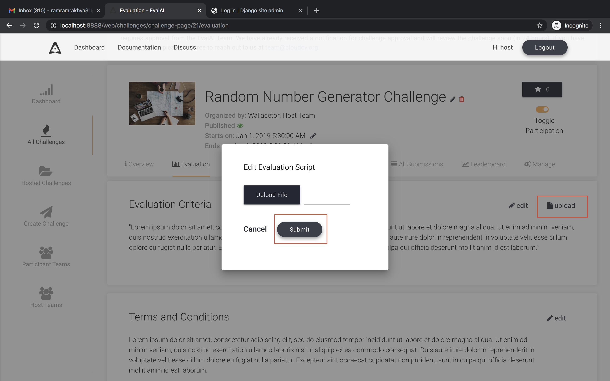

## Editing Evaluation Script

Each prediction upload challenge has an evaluation script, which evaluates the submission of participants and returns the scores which will populate the leaderboard. The logic for evaluating a submission is customizable and varies from challenge to challenge.

When setting up a new challenge, hosts need to test multiple versions of evaluation script on EvalAI. To test multiple versions of evaluation script host can update the evaluation script of existing challenge without uploading a whole new challenge configuration.

To edit the evaluation script for existing challenge please follow the following steps:

### 1. Go to the challenge page

Go to hosted challenges and select the challenge to update evaluation script

### 2. Navigate to Evaluation criteria tab

Select the Evaluation criteria tab and click on 'upload' button

### 3. Update the evaluation script

Upload the latest evaluation script and click on 'Submit' button to update the evaluation script

**Tada!** you have successfully updated the evaluation script for a challenge. The evaluation workers for the challenge will be restarted automatically to pick up the latest evaluation script. Please wait for a minimum of 10 minutes for the workers to restart.

