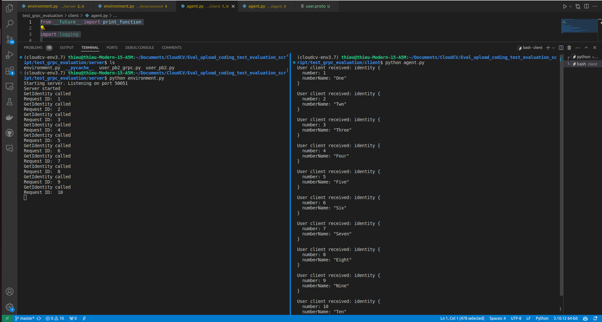

## Writing Evaluation Script

### Writing an Evaluation Script

Each challenge has an evaluation script, which evaluates the submission of participants and returns the scores which will populate the leaderboard. The logic for evaluating and judging a submission is customizable and varies from challenge to challenge, but the overall structure of evaluation scripts are fixed due to architectural reasons.

Evaluation scripts are required to have an `evaluate()` function. This is the main function, which is used by workers to evaluate the submission messages.

The syntax of evaluate function is:

```python
def evaluate(test_annotation_file, user_annotation_file, phase_codename, **kwargs):
    pass
```

It receives three arguments, namely:

- `test_annotation_file`: It represents the local path to the annotation file for the challenge. This is the file uploaded by the Challenge host while creating a challenge.

- `user_annotation_file`: It represents the local path of the file submitted by the user for a particular challenge phase.

- `phase_codename`: It is the `codename` of the challenge phase from the [challenge configuration yaml](https://github.com/Cloud-CV/EvalAI-Starters/blob/master/challenge_config.yaml). This is passed as an argument so that the script can take actions according to the challenge phase.

After reading the files, some custom actions can be performed. This varies per challenge.

The `evaluate()` method also accepts keyword arguments. By default, we provide you metadata of each submission to your challenge which you can use to send notifications to your slack channel or to some other webhook service. Following is an example code showing how to get the submission metadata in your evaluation script and send a slack notification if the accuracy is more than some value `X` (X being 90 in the example given below).

```python
def evaluate(test_annotation_file, user_annotation_file, phase_codename, **kwargs):

    submission_metadata = kwargs.get("submission_metadata")
    print submission_metadata

    # Do stuff here
    # Set `score` to 91 as an example

    score = 91
    if score > 90:
        slack_data = kwargs.get("submission_metadata")
        webhook_url = "Your slack webhook url comes here"
        # To know more about slack webhook, checkout this link: https://api.slack.com/incoming-webhooks

        response = requests.post(
            webhook_url,
            data=json.dumps({'text': "*Flag raised for submission:* \n \n" + str(slack_data)}),
            headers={'Content-Type': 'application/json'})

    # Do more stuff here
```

The above example can be modified and used to find if some participant team is cheating or not. There are many more ways for which you can use this metadata.

After all the processing is done, this `evaluate()` should return an output, which is used to populate the leaderboard. The output should be in the following format:

```python
output = {}
output['result'] = [
            {
                'train_split': {
                    'Metric1': 123,
                    'Metric2': 123,
                    'Metric3': 123,
                    'Total': 123,
                }
            },
            {
                'test_split': {
                    'Metric1': 123,
                    'Metric2': 123,
                    'Metric3': 123,
                    'Total': 123,
                }
            }
        ]

return output

```

Let's break down what is happening in the above code snippet.

1. `output` should contain a key named `result`, which is a list containing entries per dataset split that is available for the challenge phase in consideration (in the function definition of `evaluate()` shown above, the argument: `phase_codename` will receive the _codename_ for the challenge phase against which the submission was made).
2. Each entry in the list should be a dict that has a key with the corresponding dataset split codename (`train_split` and `test_split` for this example).
3. Each of these dataset split dict contains various keys (`Metric1`, `Metric2`, `Metric3`, `Total` in this example), which are then displayed as columns in the leaderboard.

### Writing Code-Upload Challenge Evaluation

Each challenge has an evaluation script, which evaluates the submission of participants and returns the scores which will populate the leaderboard. The logic for evaluating and judging a submission is customizable and varies from challenge to challenge, but the overall structure of evaluation scripts is fixed due to architectural reasons.

In code-upload challenges, the evaluation is tighly-coupled with the agent and environment containers:

1. The agent interacts with environment via actions and provides a 'stop' signal when finished. 
2. The environment provides feedback to the agent until 'stop' signal is received, episodes run out or the time limit is over.

The starter templates for code-upload challenge evaluation can be found [here](https://github.com/Cloud-CV/EvalAI-Starters/tree/master/code_upload_challenge_evaluation).

### Simple Evaluation Scripts

There are three files that you need to edit. The first one is `evaluation.proto`. To learn more about Python gRPC, please refer to the [gRPC Python Quickstart](https://grpc.io/docs/languages/python/quickstart/). Below is a sample proto file. To define the proto file, please refer to [What is gRPC?](https://grpc.io/docs/what-is-grpc/introduction/) and [gRPC Python Basics](https://grpc.io/docs/languages/python/basics/).

1. **Create a proto file**:

    For the example proto file, we focus on the `GetIdentity`. So the `GetIdentity` method in our proto to allow retrieval of a user's identity information based on a numerical ID. It uses the `GetIdentityRequest`, which accepts an integer ID, to return detailed identity data encapsulated in the `IdentityResponse`. This response includes an `Identity` object that holds a unique identifier and its corresponding name, ensuring the method can serve specific identity-related inquiries efficiently.

    ```python

    syntax = "proto3";
    package user;

    service UserService {
    rpc GetUser(GetUserRequest) returns (UserResponse) {}
    rpc GetIdentity(GetIdentityRequest) returns (IdentityResponse) {}
    }

    message GetUserRequest {
    string id = 1;
    }

    message UserResponse {
    User user = 1;
    }

    message User {
    string id = 1;
    string name = 2;
    string email = 3;
    }

    message GetIdentityRequest {
    int32 id = 1;  // Ensure this is an integer if you're passing integers
    }

    message IdentityResponse {
    Identity identity = 1;
    }

    message Identity {
    int32 number = 1;
    string numberName = 2;
    }

    ```

    To install the necessary packages, open your command prompt and navigate to your requirements folder using `cd ./requirements`. Then execute `pip install -r environments.txt` to install the packages from `environments.txt`, followed by `pip install -r agents.txt` for those in `agents.txt`. Ensure Python and pip are properly installed on your system before starting.

    To compile the `user.proto` file, open your command prompt and navigate to the directory containing the file:
    ```
    cd path/to/user.proto
    ```
    Then, execute the following command to generate the necessary Python gRPC and Protocol Buffers code:
    ```
    python -m grpc_tools.protoc -I. --python_out=. --grpc_python_out=. user.proto
    ```

    Make sure you have the `grpc_tools` package installed before running the command.

    After naming your proto file `user.proto` and compiling it, you'll generate `user_pb2.py` and `user_pb2_grpc.py`. Copy these files into your client and server directories to ensure they have access to the necessary gRPC and Protocol Buffers code.

2. **Create an environment**:

    **A. Simple environment**:
    For setting up a sample server using the provided `environment.py`, here's a brief overview:

    1. The server will listen on port 50051 and handle two functions: `GetUser` and `GetIdentity`.
    2. `GetUser` is designed to always return a fixed User object with the properties `id = 1`, `name = "John Doe"`, and `email = "john@gmail.com"`.
    3. `GetIdentity` will accept an integer `id` as input and return a corresponding word. For example, if it receives the number `2`, it will return "two".

    This setup requires the server to handle specific RPCs defined in your `.proto` files, ensuring that these operations conform to the expected inputs and outputs as described.

    ```python
    import grpc
    import gym
    import pickle
    import sys
    import os
    import requests
    import json

    from concurrent import futures
    import logging

    import grp
    import user_pb2
    import user_pb2_grpc

    import time

    EVALUATION_COMPLETED = False


    class UserService(user_pb2_grpc.UserServiceServicer):
        def GetUser(self, request, context):
            print("GetUser called")
            return user_pb2.User(id="1", name="John Doe", email="john@gmail.com")
        
        # create a dictionary to store the number and its calls. For example: 1: One
        number_to_calls = {
            1: "One",
            2: "Two",
            3: "Three",
            4: "Four",
            5: "Five",
            6: "Six",
            7: "Seven",
            8: "Eight",
            9: "Nine",
            10: "Ten"
        }

        def GetIdentity(self, request, context):
            print("GetIdentity called")
            print("Request ID: ", request.id)
            return user_pb2.IdentityResponse(identity=user_pb2.Identity(number=request.id, numberName=self.number_to_calls[request.id]))
            
    def serve():
        server = grpc.server(futures.ThreadPoolExecutor(max_workers=1))
        user_pb2_grpc.add_UserServiceServicer_to_server(UserService(), server)
        print("Starting server. Listening on port 50051")
        server.add_insecure_port("[::]:50051")
        server.start()
        print("Server started")
        try:
            while not EVALUATION_COMPLETED:
                time.sleep(4)
            server.stop(0)
        except KeyboardInterrupt:
            server.stop(0)


    if __name__ == '__main__':
        logging.basicConfig()
        serve()`

    ```

    In the setup described for `agent.py`, the script performs the following tasks:

    1. Iterates through a list of numbers ranging from 1 to 10.
    2. For each number in the list, it calls the `GetIdentity` function on a server.
    3. `GetIdentity` is expected to return a corresponding word for each number, which the agent then receives.

    This design implies that `agent.py` acts as a client, making RPC calls to the server which processes these requests by converting numbers to their word forms based on the implementation details provided in `GetIdentity`.

    ```python
    from __future__ import print_function

    import logging

    import grpc
    import user_pb2 
    import user_pb2_grpc

    def run():

        # a list of number from 1 to 10
        numbers = range(1, 11)

        with grpc.insecure_channel('localhost:50051') as channel:
            stub = user_pb2_grpc.UserServiceStub(channel)

            for number in numbers:
                response = stub.GetIdentity(user_pb2.GetIdentityRequest(id=number))

                print("User client received: " + str(response) )

    run()
    ```
    
    After setting up and running the server and agent as described, the expected result should display a sequence where the agent, for each number from 1 to 10, calls the GetIdentity function on the server and receives a corresponding word

    <br />

    ### Advanced Evaluation Scripts

    There are few steps involved in creating an advanced environment:
    1. *Edit the evaluator_environment*: This class defines the environment (a [gym environment](https://www.gymlibrary.dev/content/environment_creation/) or a [habitat environment](https://github.com/facebookresearch/habitat-lab/blob/b1f2d4791a0065d0791001b72a6c96748a5f9ae0/habitat-lab/habitat/core/env.py)) and other related attributes/methods. Modify the `evaluator_environment` containing a gym environment shown [here](https://github.com/Cloud-CV/EvalAI-Starters/blob/8338085c6335487332f5b57cf7182201b8499aad/code_upload_challenge_evaluation/environment/environment.py#L21-L32):

        ```python
        class evaluator_environment:
            def __init__(self, environment="CartPole-v0"):
                self.score = 0
                self.feedback = None
                self.env = gym.make(environment)
                self.env.reset()

            def get_action_space(self):
                return list(range(self.env.action_space.n))

            def next_score(self):
                self.score += 1
        ```

        There are three methods in this example:
        - `__init__`: The initialization method to instantiate and set up the evaluation environment.
        - `get_action_space`: Returns the action space of the agent in the environment.
        - `next_score`: Returns/updates the reward achieved.

        You can add custom methods and attributes which help in interaction with the environment.

    2. *Edit the Environment service*: This service is hosted on the [gRPC](https://grpc.io/) server to get actions in form of messages from the agent container. Modify the lines shown [here](https://github.com/Cloud-CV/EvalAI-Starters/blob/8338085c6335487332f5b57cf7182201b8499aad/code_upload_challenge_evaluation/environment/environment.py#L35-L65):

        ```python
        class Environment(evaluation_pb2_grpc.EnvironmentServicer):
            def __init__(self, challenge_pk, phase_pk, submission_pk, server):
                self.challenge_pk = challenge_pk
                self.phase_pk = phase_pk
                self.submission_pk = submission_pk
                self.server = server

            def get_action_space(self, request, context):
                message = pack_for_grpc(env.get_action_space())
                return evaluation_pb2.Package(SerializedEntity=message)

            def act_on_environment(self, request, context):
                global EVALUATION_COMPLETED
                if not env.feedback or not env.feedback[2]:
                    action = unpack_for_grpc(request.SerializedEntity)
                    env.next_score()
                    env.feedback = env.env.step(action)
                if env.feedback[2]:
                    if not LOCAL_EVALUATION:
                        update_submission_result(
                            env, self.challenge_pk, self.phase_pk, self.submission_pk
                        )
                    else:
                        print("Final Score: {0}".format(env.score))
                        print("Stopping Evaluation!")
                        EVALUATION_COMPLETED = True
                return evaluation_pb2.Package(
                    SerializedEntity=pack_for_grpc(
                        {"feedback": env.feedback, "current_score": env.score,}
                    )
                )
        ```

        You can modify the relevant parts of the environment service in order to make it work for your case.
        You would need to serialize and deserialize the response/request to pass messages between the agent and environment over gRPC. For this, we have implemented two methods which might be useful:
        - `unpack_for_grpc`: This method deserializes entities from request/response sent over gRPC. This is useful for receiving messages (for example, actions from the agent).
        - `pack_for_grpc`: This method serializes entities to be sent over a request over gRPC. This is useful for sending messages (for example, feedback from the environment).

        **Note**: This is a basic description of the class and the implementations may vary on a case-by-case basis.

    3. *Edit the requirements file*: Change the [requirements file](https://github.com/Cloud-CV/EvalAI-Starters/blob/master/code_upload_challenge_evaluation/requirements/environment.txt) according to the packages required by your environment.

    4. *Edit environment Dockerfile*: You may choose to modify the [Dockerfile](https://github.com/Cloud-CV/EvalAI-Starters/blob/master/code_upload_challenge_evaluation/docker/environment/Dockerfile) that will set up and run the environment service.

    5. *Edit the docker environment variables*: Fill in the following information in the [`docker.env`](https://github.com/Cloud-CV/EvalAI-Starters/blob/master/code_upload_challenge_evaluation/docker/environment/docker.env) file:

        ```env
        AUTH_TOKEN=<Add your EvalAI Auth Token here>
        EVALAI_API_SERVER=<https://eval.ai>
        LOCAL_EVALUATION = True
        QUEUE_NAME=<Go to the challenge manage tab to get challenge queue name.>
        ```

    6. *Create the docker image and upload on ECR*: Create an environment docker image for the created `Dockerfile` by using:

        ```sh
        docker build -f <file_path_to_Dockerfile>
        ````

        Upload the created docker image to ECR:

        ```sh
        aws ecr get-login-password --region <region> | docker login --username AWS --password-stdin <aws_account_id>.dkr.ecr.<region>.amazonaws.com
        docker tag <image_id> <aws_account_id>.dkr.ecr.<region>.amazonaws.com/<my-repository>:<tag>
        docker push <aws_account_id>.dkr.ecr.<region>.amazonaws.com/<my-repository>:<tag>
        ```

        Detailed steps for uploading a docker image to ECR can be found [here](https://docs.aws.amazon.com/AmazonECR/latest/userguide/docker-push-ecr-image.html).

    7. *Add environment image the challenge configuration for challenge phase*: For each challenge phase, add the link to the environment image in the [challenge configuration](https://evalai.readthedocs.io/en/latest/configuration.html):

        ```yaml
        ...
        challenge_phases:
            - id: 1
            ...
            - environment_image: <docker image uri>
        ...
        ```

    Example References:
    - [Habitat Benchmark](https://github.com/facebookresearch/habitat-lab/blob/b1f2d4791a0065d0791001b72a6c96748a5f9ae0/habitat-lab/habitat/core/benchmark.py): This file contains description of an evaluation class which evaluates agents on the environment.

2. **Create a starter example**:
    The participants are expected to submit docker images for their agents which will contain the policy and the methods to interact with the environment.

    Like environment, there are a few steps involved in creating the agent:
    1. *Create a starter example script*: Please create a starter agent submission and a local evaluation script in order to help the participants perform sanity checks on their code before making submissions to EvalAI.

        The `agent.py` file should contain a description of the agent, the methods that the environment expects the agent to have, and a `main()` function to pass actions to the environment.

        We provide a template for `agent.py` [here](https://github.com/Cloud-CV/EvalAI-Starters/blob/master/code_upload_challenge_evaluation/agent/agent.py):

        ```python
        import evaluation_pb2
        import evaluation_pb2_grpc
        import grpc
        import os
        import pickle
        import time

        time.sleep(30)

        LOCAL_EVALUATION = os.environ.get("LOCAL_EVALUATION")

        if LOCAL_EVALUATION:
            channel = grpc.insecure_channel("environment:8085")
        else:
            channel = grpc.insecure_channel("localhost:8085")

        stub = evaluation_pb2_grpc.EnvironmentStub(channel)

        def pack_for_grpc(entity):
            return pickle.dumps(entity)

        def unpack_for_grpc(entity):
            return pickle.loads(entity)

        flag = None

        while not flag:
            base = unpack_for_grpc(
                stub.act_on_environment(
                    evaluation_pb2.Package(SerializedEntity=pack_for_grpc(1))
                ).SerializedEntity
            )
            flag = base["feedback"][2]
            print("Agent Feedback", base["feedback"])
            print("*"* 100)

        ```

        **Other Examples**:
           -   A [random agent](https://github.com/facebookresearch/habitat-challenge/blob/rearrangement-challenge-2022/agents/random_agent.py) from [Habitat Rearrangement Challenge 2022](https://github.com/facebookresearch/habitat-challenge/blob/rearrangement-challenge-2022)

    2. *Edit the requirements file*: Change the [requirements file](https://github.com/Cloud-CV/EvalAI-Starters/blob/master/code_upload_challenge_evaluation/requirements/agent.txt) according to the packages required by an agent.

    3. *Edit environment Dockerfile*: You may choose to modify the [Dockerfile](https://github.com/Cloud-CV/EvalAI-Starters/blob/master/code_upload_challenge_evaluation/docker/agent/Dockerfile) which will run the `agent.py` file and interact with environment.

    4. *Edit the docker environment variables*: Fill in the following information in the [`docker.env`](https://github.com/Cloud-CV/EvalAI-Starters/blob/master/code_upload_challenge_evaluation/docker/agent/docker.env) file:

        ```env
        LOCAL_EVALUATION = True
        ```

    Example References:
    - [Habitat Rearrangement Challenge 2022 - Random Agent](https://github.com/facebookresearch/habitat-challenge/blob/rearrangement-challenge-2022/agents/random_agent.py): This is an example of a dummy agent created for the [Habitat Rearrangement Challenge 2022](https://eval.ai/web/challenges/challenge-page/1820/overview) which is then sent to the evaluator (here, [Habitat Benchmark](https://github.com/facebookresearch/habitat-lab/blob/b1f2d4791a0065d0791001b72a6c96748a5f9ae0/habitat-lab/habitat/core/benchmark.py)) for evaluation.

### Writing Remote Evaluation Script

Each challenge has an evaluation script, which evaluates the submission of participants and returns the scores which will populate the leaderboard. The logic for evaluating and judging a submission is customizable and varies from challenge to challenge, but the overall structure of evaluation scripts is fixed due to architectural reasons.

The starter template for remote challenge evaluation can be found [here](https://github.com/Cloud-CV/EvalAI-Starters/blob/master/remote_challenge_evaluation/evaluation_script_starter.py).

Here are the steps to configure remote evaluation:

1. **Setup Configs**:

    To configure authentication for the challenge set the following environment variables:

    1. AUTH_TOKEN:  Go to [profile page](https://eval.ai/web/profile) -> Click on `Get your Auth Token` -> Click on the Copy button. The auth token will get copied to your clipboard.
    2. API_SERVER: Use `https://eval.ai` when setting up challenge on production server. Otherwise, use `https://staging.eval.ai`
        <br />
        <br />
    3. QUEUE_NAME: Go to the challenge manage tab to fetch the challenge queue name.
    4. CHALLENGE_PK: Go to the challenge manage tab to fetch the challenge primary key.
        <br />
    5. SAVE_DIR: (Optional) Path to submission data download location.

2. **Write `evaluate` method**:
    Evaluation scripts are required to have an `evaluate()` function. This is the main function, which is used by workers to evaluate the submission messages.

    The syntax of evaluate function for a remote challenge is:

    ```python
    def evaluate(user_submission_file, phase_codename, test_annotation_file = None, **kwargs)
        pass
    ```

    It receives three arguments, namely:

    - `user_annotation_file`: It represents the local path of the file submitted by the user for a particular challenge phase.

    - `phase_codename`: It is the `codename` of the challenge phase from the [challenge configuration yaml](https://github.com/Cloud-CV/EvalAI-Starters/blob/master/challenge_config.yaml). This is passed as an argument so that the script can take actions according to the challenge phase.

    - `test_annotation_file`: It represents the local path to the annotation file for the challenge. This is the file uploaded by the Challenge host while creating a challenge.

    You may pass the `test_annotation_file` as default argument or choose to pass separately in the `main.py` depending on the case. The `phase_codename` is passed automatically but is left as an argument to allow customization.

    After reading the files, some custom actions can be performed. This varies per challenge.

    The `evaluate()` method also accepts keyword arguments.

    **IMPORTANT** ⚠️: If the `evaluate()` method fails due to any reason or there is a problem with the submission, please ensure to raise an `Exception` with an appropriate message.

### Writing Static Code-Upload Challenge Evaluation Script

Each challenge has an evaluation script, which evaluates the submission of participants and returns the scores which will populate the leaderboard. The logic for evaluating and judging a submission is customizable and varies from challenge to challenge, but the overall structure of evaluation scripts are fixed due to architectural reasons.

The starter template for static code-upload challenge evaluation can be found [here](https://github.com/Cloud-CV/EvalAI-Starters/blob/master/evaluation_script/main.py). Note that the evaluation file provided will be used on our submission workers, just like prediction upload challenges.

The steps for writing an evaluation script for a static code-upload based challenge are the same as that for [prediction-upload based challenges](evaluation_scripts.html#writing-an-evaluation-script) section.

Evaluation scripts are required to have an `evaluate()` function. This is the main function, which is used by workers to evaluate the submission messages.

The syntax of evaluate function is:

```python
def evaluate(test_annotation_file, user_annotation_file, phase_codename, **kwargs):
    pass
```

It receives three arguments, namely:

- `test_annotation_file`: It represents the local path to the annotation file for the challenge. This is the file uploaded by the Challenge host while creating a challenge.

- `user_annotation_file`: It represents the local path of the file submitted by the user for a particular challenge phase.

- `phase_codename`: It is the `codename` of the challenge phase from the [challenge configuration yaml](https://github.com/Cloud-CV/EvalAI-Starters/blob/master/challenge_config.yaml). This is passed as an argument so that the script can take actions according to the challenge phase.

After reading the files, some custom actions can be performed. This varies per challenge.

The `evaluate()` method also accepts keyword arguments. By default, we provide you metadata of each submission to your challenge which you can use to send notifications to your slack channel or to some other webhook service. Following is an example code showing how to get the submission metadata in your evaluation script and send a slack notification if the accuracy is more than some value `X` (X being 90 in the example given below).

```python
def evaluate(test_annotation_file, user_annotation_file, phase_codename, **kwargs):

    submission_metadata = kwargs.get("submission_metadata")
    print submission_metadata

    # Do stuff here
    # Set `score` to 91 as an example

    score = 91
    if score > 90:
        slack_data = kwargs.get("submission_metadata")
        webhook_url = "Your slack webhook url comes here"
        # To know more about slack webhook, checkout this link: https://api.slack.com/incoming-webhooks

        response = requests.post(
            webhook_url,
            data=json.dumps({'text': "*Flag raised for submission:* \n \n" + str(slack_data)}),
            headers={'Content-Type': 'application/json'})

    # Do more stuff here
```

The above example can be modified and used to find if some participant team is cheating or not. There are many more ways for which you can use this metadata.

After all the processing is done, this `evaluate()` should return an output, which is used to populate the leaderboard. The output should be in the following format:

```python
output = {}
output['result'] = [
            {
                'train_split': {
                    'Metric1': 123,
                    'Metric2': 123,
                    'Metric3': 123,
                    'Total': 123,
                }
            },
            {
                'test_split': {
                    'Metric1': 123,
                    'Metric2': 123,
                    'Metric3': 123,
                    'Total': 123,
                }
            }
        ]

return output

```

Let's break down what is happening in the above code snippet.

1. `output` should contain a key named `result`, which is a list containing entries per dataset split that is available for the challenge phase in consideration (in the function definition of `evaluate()` shown above, the argument: `phase_codename` will receive the _codename_ for the challenge phase against which the submission was made).
2. Each entry in the list should be a dict that has a key with the corresponding dataset split codename (`train_split` and `test_split` for this example).
3. Each of these dataset split dict contains various keys (`Metric1`, `Metric2`, `Metric3`, `Total` in this example), which are then displayed as columns in the leaderboard.

A good example of a well-documented evaluation script for static code-upload challenges is [My Seizure Gauge Forecasting Challenge 2022](https://github.com/seermedical/msg-2022).
