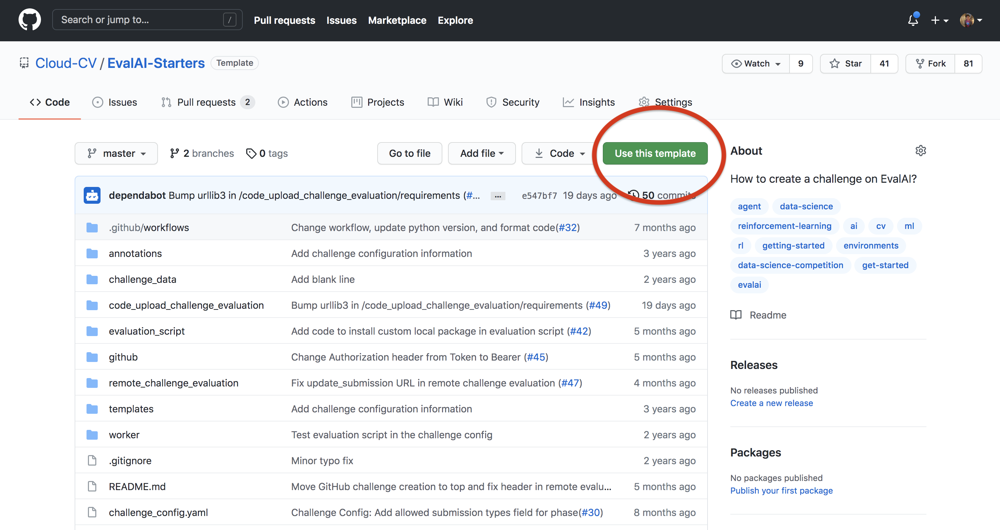
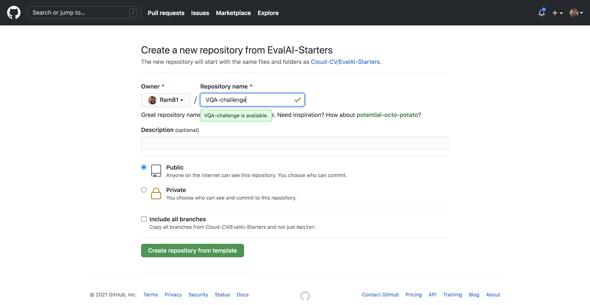
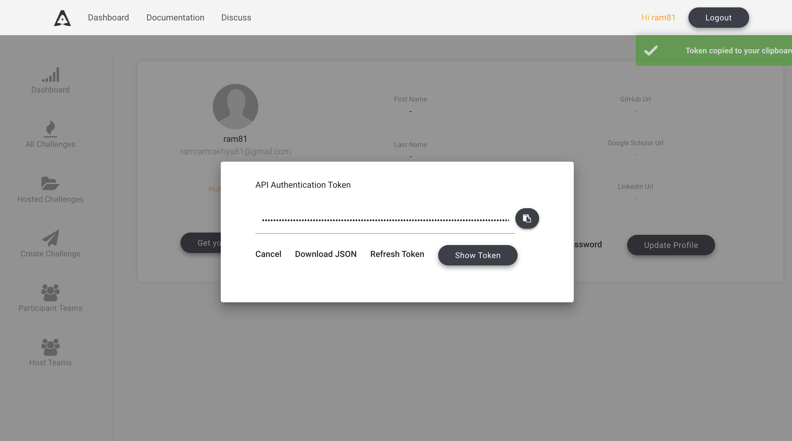
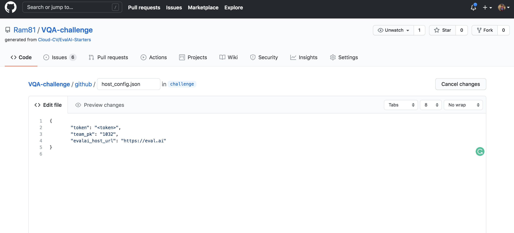
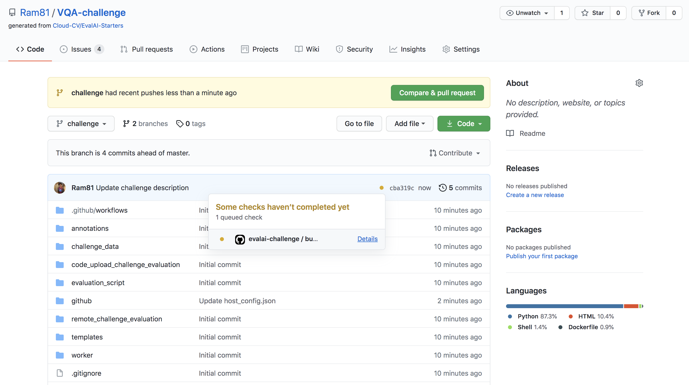

## Setup challenge using github

1. Use [EvalAI-Starters](https://github.com/Cloud-CV/EvalAI-Starters) template to start. See [this](https://docs.github.com/en/free-pro-team@latest/github/creating-cloning-and-archiving-repositories/creating-a-repository-from-a-template) on how to use a repository as template.

    
    

2. Generate your [github personal acccess token](https://docs.github.com/en/free-pro-team@latest/github/authenticating-to-github/creating-a-personal-access-token) and copy it in clipboard.

3. Add the github personal access token in the forked repository's [secrets](https://docs.github.com/en/free-pro-team@latest/actions/reference/encrypted-secrets#creating-encrypted-secrets-for-a-repository) with the name `AUTH_TOKEN`.

4. Now, go to [EvalAI](https://eval.ai) to fetch the following details -
   1. `evalai_user_auth_token` - Go to [profile page](https://eval.ai/web/profile) after logging in and click on `Get your Auth Token` to copy your auth token.
   2. `host_team_pk` - Go to [host team page](https://eval.ai/web/challenge-host-teams) and copy the `ID` for the team you want to use for challenge creation.
   3. `evalai_host_url` - Use `https://eval.ai` for production server and `https://staging.eval.ai` for staging server.

    

5. Create a branch with name `challenge` in the forked repository from the `master` branch.
Note: Only changes in `challenge` branch will be synchronized with challenge on EvalAI.

6. Add `evalai_user_auth_token` and `host_team_pk` in `github/host_config.json`.
    

7. Read [EvalAI challenge creation documentation](https://evalai.readthedocs.io/en/latest/configuration.html) to know more about how you want to structure your challenge. Once you are ready, start making changes in the yaml file, HTML templates, evaluation script according to your need.

8. Commit the changes and push the `challenge` branch in the repository and wait for the build to complete. View the [logs of your build](https://docs.github.com/en/free-pro-team@latest/actions/managing-workflow-runs/using-workflow-run-logs#viewing-logs-to-diagnose-failures).
     
     

9. If challenge config contains errors then a `issue` will be opened automatically in the repository with the errors otherwise the challenge will be created on EvalAI.

10. Go to [Hosted Challenges](https://eval.ai/web/hosted-challenges) to view your challenge. The challenge will be publicly available once EvalAI admin approves the challenge.

11. To update the challenge on EvalAI, make changes in the repository and push on `challenge` branch and wait for the build to complete.