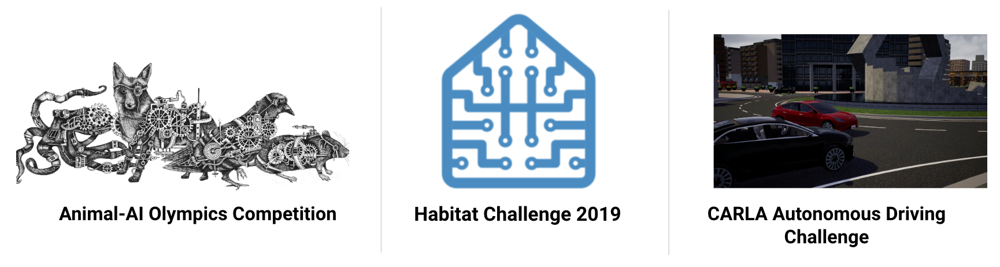
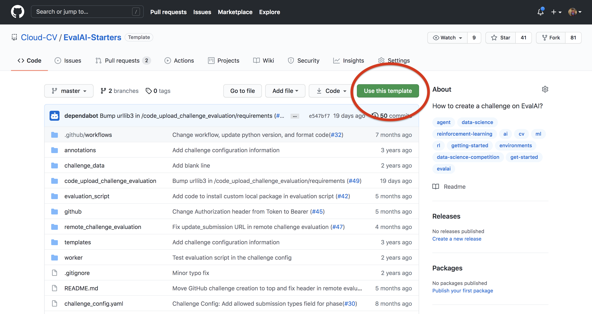
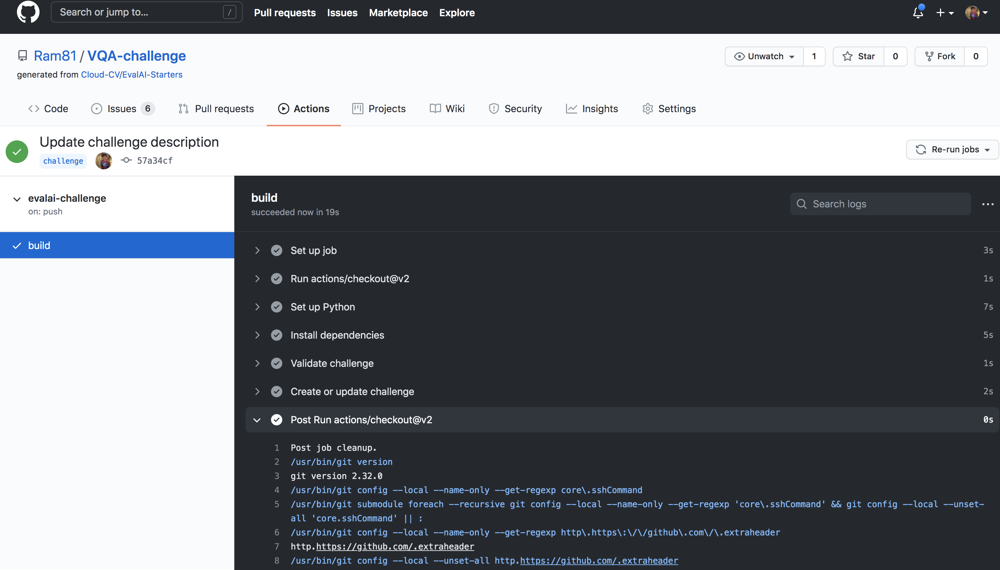

# Host challenge

EvalAI supports hosting challenges with different configurations. Challenge organizers can choose to customize most aspects of the challenge but not limited to:

- Evaluation metrics
- Language/Framework to implement the metric
- Number of phases and data-splits
- Daily / monthly / overall submission limit
- Number of workers evaluating submissions
- Evaluation on remote machines
- Provide your AWS credentials to host code-upload based challenge
- Show / hide error bars on leaderboard
- Public / private leaderboards
- Allow / block certain email addresses to participate in the challenge or phase
- Choose which fields to export while downloading challenge submissions

We have hosted challenges from different domains such as:

- Machine learning ([2019 SIOP Machine Learning Competition](https://eval.ai/web/challenges/challenge-page/160/leaderboard/481))
- Deep learning ([Visual Dialog Challenge 2019 ](https://eval.ai/web/challenges/challenge-page/161/leaderboard/483))
- Computer vision ([Vision and Language Navigation](https://eval.ai/web/challenges/challenge-page/97/leaderboard/270))
- Natural language processing ([VQA Challenge 2019](https://eval.ai/web/challenges/challenge-page/163/leaderboard/498))
- Healthcare ([fastMRI Image Reconstruction ](https://eval.ai/web/challenges/challenge-page/153/leaderboard/447))
- Self-driving cars ([CARLA Autonomous Driving Challenge](https://eval.ai/web/challenges/challenge-page/246/leaderboard/817))

We categorize the challenges in two categories:

1. **Prediction upload based challenges**: Participants upload predictions corresponding to ground truth labels in the form of a file (could be any format: `json`, `npy`, `csv`, `txt` etc.)

   Some of the popular prediction upload based challenges that we have hosted are shown below:

   <a href="https://eval.ai/web/challenges/list" target="_blank"></a><br />

   If you are interested in hosting prediction upload based challenges, then [click here](host_challenge.html#host-prediction-upload-based-challenge).

    <br />

2. **Code-upload based challenges**: In these kind of challenges, participants upload their training code in the form of docker images using [EvalAI-CLI](https://github.com/Cloud-CV/evalai-cli/).

   We support two types of code-upload based challenges -
      - Code-Upload Based Challenge (without Static Dataset): These are usually reinforcement learning challenges which involve uploading a trained model in form of docker images and the environment is also saved in form of a docker image.
      - Static Code-Upload Based Challenge: These are challenges where the host might want the participants to upload models and they have static dataset on which they want to run the models and perform evaluations. This kind of challenge is especially useful in case of data privacy concerns.

   We support two types of code-upload based challenges -
      - Code-Upload Based Challenge (without Static Dataset): These are usually reinforcement learning challenges which involve uploading a trained agent in form of docker images and the environment is also saved in form of a docker image.
      - Static Code-Upload Based Challenge: These are challenges where the host might want the participants to upload models and they have static dataset on which they want to run the models and perform evaluations. This kind of challenge is especially useful in case of data privacy concerns.

   Some of the popular code-upload based challenges that we have hosted are shown below:

   <a href="https://eval.ai/web/challenges/list" target="_blank"></a>

   If you are interested in hosting code-upload based challenges, then [click here](host_challenge.html#host-code-upload-based-challenge). If you are interested in hosting static code-upload based challenges, then [click here](host_challenge.html#host-static-code-upload-based-challenge).

   A good reference would be the [Habitat Re-arrangement Challenge 2022](https://github.com/facebookresearch/habitat-challenge/tree/rearrangement-challenge-2022).

## Host challenge using github

### Step 1: Use template

Use [EvalAI-Starters](https://github.com/Cloud-CV/EvalAI-Starters) template. See [this](https://docs.github.com/en/free-pro-team@latest/github/creating-cloning-and-archiving-repositories/creating-a-repository-from-a-template) on how to use a repository as template.

   <br />
   <br />

### Step 2: Generate github token

Generate your [github personal acccess token](https://docs.github.com/en/free-pro-team@latest/github/authenticating-to-github/creating-a-personal-access-token) and copy it in clipboard.

Add the github personal access token in the forked repository's [secrets](https://docs.github.com/en/free-pro-team@latest/actions/reference/encrypted-secrets#creating-encrypted-secrets-for-a-repository) with the name `AUTH_TOKEN`.

### Step 3: Setup host configuration

Now, go to [EvalAI](https://eval.ai) to fetch the following details -
   1. `evalai_user_auth_token` - Go to [profile page](https://eval.ai/web/profile) after logging in and click on `Get your Auth Token` to copy your auth token.
   2. `host_team_pk` - Go to [host team page](https://eval.ai/web/challenge-host-teams) and copy the `ID` for the team you want to use for challenge creation.
   3. `evalai_host_url` - Use `https://eval.ai` for production server and `https://staging.eval.ai` for staging server.

   <br />

### Step 4: Setup automated update push

Create a branch with name `challenge` in the forked repository from the `master` branch.
<span style="color:purple">Note: Only changes in `challenge` branch will be synchronized with challenge on EvalAI.</span>

Add `evalai_user_auth_token` and `host_team_pk` in `github/host_config.json`.
   <br />

### Step 5: Update challenge details

Read [EvalAI challenge creation documentation](https://evalai.readthedocs.io/en/latest/configuration.html) to know more about how you want to structure your challenge. Once you are ready, start making changes in the yaml file, HTML templates, evaluation script according to your need.

### Step 6: Push changes to the challenge

Commit the changes and push the `challenge` branch in the repository and wait for the build to complete. View the [logs of your build](https://docs.github.com/en/free-pro-team@latest/actions/managing-workflow-runs/using-workflow-run-logs#viewing-logs-to-diagnose-failures).
    <br />
    <br />

If challenge config contains errors then a `issue` will be opened automatically in the repository with the errors otherwise the challenge will be created on EvalAI.

### Step 7: Verify challenge

Go to [Hosted Challenges](https://eval.ai/web/hosted-challenges) to view your challenge. The challenge will be publicly available once EvalAI admin approves the challenge.

To update the challenge on EvalAI, make changes in the repository and push on `challenge` branch and wait for the build to complete.

## Host prediction upload based challenge

### Step 1: Setup challenge configuration

We have created a sample challenge configuration that we recommend you to use to get started. Use [EvalAI-Starters](https://github.com/Cloud-CV/EvalAI-Starters) template to start. See [this](https://docs.github.com/en/free-pro-team@latest/github/creating-cloning-and-archiving-repositories/creating-a-repository-from-a-template) on how to use a repository as template.

### Step 2: Edit challenge configuration

Open [`challenge_config.yml`](https://github.com/Cloud-CV/EvalAI-Starters/blob/master/challenge_config.yaml) from the repository that you cloned in step-1. This file defines all the different settings of your challenge such as start date, end date, number of phases, and submission limits etc.

Edit this file based on your requirement. For reference to the fields, refer to the [challenge configuration reference section](configuration.html).

### Step 3: Edit evaluation script

Next step is to edit the challenge evaluation script that decides what metrics the submissions are going to be evaluated on for different phases.

Please refer to the [writing evaluation script](evaluation_scripts.html) to complete this step.

### Step 4: Edit challenge HTML templates

Almost there. You just need to update the HTML templates in the `templates/` directory of the bundle that you cloned.

EvalAI supports all kinds of HTML tags which means you can add images, videos, tables etc. Moreover, you can add inline CSS to add custom styling to your challenge details.
<!-- 
### Step 5: Upload configuration on EvalAI

Finally run the `./run.sh` script in the bundle. It will generate a `challenge_config.zip` file that contains all the details related to the challenge. Now, visit [EvalAI - Host challenge page](https://eval.ai/web/challenge-host-teams) and select/create a challenge host team. Then upload the `challenge_config.zip`. -->

**Congratulations!** you have submitted your challenge configuration for review and [EvalAI team](https://eval.ai/team) has notified about this. [EvalAI team](https://eval.ai/team) will review and will approve the challenge.

If you have issues in creating a challenge on EvalAI, please feel free to contact us at [team@cloudcv.org](mailto:team@cloudcv.org) create an issue on our [GitHub issues page](https://github.com/Cloud-CV/EvalAI/issues/new).

## Host code-upload based challenge

### Step 1: Setup challenge repository

Steps to create a code-upload based challenge are somewhat similar to what it takes to create a [prediction upload based challenge](host_challenge.html#host-a-prediction-upload-based-challenge).

We have created a sample challenge repository that we recommend you to use to get started. Use [EvalAI-Starters](https://github.com/Cloud-CV/EvalAI-Starters) template to start. See [this](https://docs.github.com/en/free-pro-team@latest/github/creating-cloning-and-archiving-repositories/creating-a-repository-from-a-template) on how to use a repository as template.

### Step 2: Edit challenge configuration

Open [`challenge_config.yml`](https://github.com/Cloud-CV/EvalAI-Starters/blob/master/challenge_config.yaml) from the repository that you cloned in step-1. This file defines all the different settings of your challenge such as start date, end date, number of phases, and submission limits etc. Edit this file based on your requirement.

Please ensure the following fields are set to the following values for code-upload based challenges:

- `remote_evaluation : True`
- `is_docker_based : True`

In order to perform evaluation, you might also need to create an EKS cluster on AWS. This is because we expect to use docker containers for both - the agent, and the environment. See [AWS Elastic Kubernetes Service](https://aws.amazon.com/eks/) to learn more about what EKS is and how it works.

We need the following details for the EKS cluster in order to perform evaluations in case you are using your own AWS account:

- `aws_account_id: <AWS Account ID>`
- `aws_access_key_id: <AWS Access Key ID>`
- `aws_secret_access_key: <AWS Secret Access Key>`
- `aws_region: <AWS Region>`

These details need to be emailed us at [team@cloudcv.org](mailto:team@cloudcv.org). The EvalAI team will set up the infrastructure in your AWS account.
For reference to the other fields, refer to the [challenge configuration reference section](configuration.html).

### Step 3: Edit evaluation code

Next step is to create code-upload challenge evaluation that decides what metrics the submissions are going to be evaluated on for different phases.

For code-upload challenges, the environment image is expected to be created by the host and the agent image is to be pushed by the participants.

Please refer to the [Writing Code-Upload Challenge Evaluation](evaluation_scripts.html#writing-code-upload-challenge-evaluation) section to complete this step.

### Step 4: Edit challenge HTML templates

Almost there. You just need to update the HTML templates in the `templates/` directory of the bundle that you cloned.

EvalAI supports all kinds of HTML tags which means you can add images, videos, tables etc. Moreover, you can add inline CSS to add custom styling to your challenge details.

Please include a detailed [`submission_guidelines.html`](https://github.com/Cloud-CV/EvalAI-Starters/blob/master/templates/submission_guidelines.html) as it is usually not as straightforward for the participants to upload submissions for code-upload challenges.

The participants are expected to submit links to their agent docker images using [`evalai-cli`](https://github.com/Cloud-CV/evalai-cli/). Here is an example of a command:

```sh
evalai push <image>:<tag> --phase <phase_name>
```

Please refer to the [documentation](https://cli.eval.ai/) for more details on this.

A good example of submission guidelines for code-upload challenges is present [here](https://eval.ai/web/challenges/challenge-page/1820/submission).

<!-- ### Step 5: Upload configuration on EvalAI

Finally run the `./run.sh` script in the bundle. It will generate a `challenge_config.zip` file that contains all the details related to the challenge. Now, visit [EvalAI - Host challenge page](https://eval.ai/web/challenge-host-teams) and select/create a challenge host team. Then upload the `challenge_config.zip`. -->

**Congratulations!** you have submitted your challenge configuration for review and [EvalAI team](https://eval.ai/team) has notified about this. [EvalAI team](https://eval.ai/team) will review and will approve the challenge.

## Host static code-upload based challenge

### Step 1: Setup challenge repository

Steps to create a static code-upload based challenge are very similar to what it takes to create a [prediction upload based challenge](host_challenge.html#host-a-prediction-upload-based-challenge) and [code-upload based challenge](host_challenge.html#host-code-upload-based-challenge).

We have created a sample challenge repository that we recommend you to use to get started. Use [EvalAI-Starters](https://github.com/Cloud-CV/EvalAI-Starters) template to start. See [this](https://docs.github.com/en/free-pro-team@latest/github/creating-cloning-and-archiving-repositories/creating-a-repository-from-a-template) on how to use a repository as template.

### Step 2: Edit challenge configuration

Open [`challenge_config.yml`](https://github.com/Cloud-CV/EvalAI-Starters/blob/master/challenge_config.yaml) from the repository that you cloned in step-1. This file defines all the different settings of your challenge such as start date, end date, number of phases, and submission limits etc. Edit this file based on your requirement.

Please ensure the following fields are set to the following values for static code-upload based challenges:

- `remote_evaluation : True`
- `is_docker_based : True`
- `is_static_dataset_code_upload : True`

In order to perform evaluation, you might also need to create an EKS cluster on AWS. This is because we use docker containers for managing the evaluation environment, and as well as model container. See [AWS Elastic Kubernetes Service](https://aws.amazon.com/eks/) to learn more about what EKS is and how it works.

We need the following details for the EKS cluster in order to perform evaluations in case you are using your own AWS account:

- `aws_account_id: <AWS Account ID>`
- `aws_access_key_id: <AWS Access Key ID>`
- `aws_secret_access_key: <AWS Secret Access Key>`
- `aws_region: <AWS Region>`

These details need to be emailed us at [team@cloudcv.org](mailto:team@cloudcv.org). The EvalAI team will set up the infrastructure in your AWS account.

For reference to the other fields, refer to the [challenge configuration reference section](configuration.html).

### Step 3: Save the static dataset using EFS

Use [AWS EFS](https://aws.amazon.com/efs/) to store the static dataset file(s) on which the evaluation is to be performed. By default an `EFS` file system is created and the file system ID is stored in `efs_id` in the Challenge Evaluation Cluster and then the file system is mounted on the instances inside the cluster.

### Step 4: Create a sample submission Dockerfile

Create a Dockerfile showing the participants how to install their requirements and run the submission script which produces the predictions file. This docker image is then run on the cluster to perform predictions.

An template Dockerfile is shown below:

```Dockerfile
FROM nvidia/cuda:11.2.0-cudnn8-runtime-ubuntu20.04

RUN apt-get update &&\
    DEBIAN_FRONTEND=noninteractive apt-get install -y python3 &&\
    apt-get install -y

# ADITIONAL PYTHON DEPENDENCIES
COPY requirements.txt ./
RUN pip install -r requirements.txt

WORKDIR /app

# COPY WHATEVER OTHER SCRIPTS YOU MAY NEED
COPY trained_model /trained_model
# SPECIFY THE ENTRYPOINT SCRIPT
CMD ["python", "-u", "submission.py"]
```

This docker image will run `submission.py` script and the script will save the predictions at the specified location.

### Step 5: Edit evaluation script

Next step is to write the evaluation script to compute the metrics for each submission.

Please refer to the [Writing Static Code-Upload Challenge Evaluation](evaluation_scripts.html#writing-static-code-upload-challenge-evaluation) section to complete this step.

### Step 6: Prepare detailed documentation

Prepare a detailed documentation describing the following details:

- Input/Output Format: Details about the model input format and the expected model output format for the participants with examples.
- Expected Input/Output Files Names: The documentation should also contain where the dataset is expected to be stored in the docker container, where to save the file, and the output file name.
- Docker commands/script: The docker commands/script to create the docker container from the Docker file.
- Submission Command: The `evalai-cli` command to push the container.
- Any other installation, processing, training tips required for the task.

It is recommended to look at the example of [My Seizure Gauge Forecasting Challenge 2022](https://github.com/seermedical/msg-2022) which contain extensively described steps and documentation for everything, along with tips for every step of challenge participation.

### Step 7: Edit challenge HTML templates

Almost there. You just need to update the HTML templates in the `templates/` directory of the bundle that you cloned.

EvalAI supports all kinds of HTML tags which means you can add images, videos, tables etc. Moreover, you can add inline CSS to add custom styling to your challenge details.

Please include a detailed [`submission_guidelines.html`](https://github.com/Cloud-CV/EvalAI-Starters/blob/master/templates/submission_guidelines.html) as it is usually not as straightforward for the participants to upload submissions for static code-upload challenges.

The participants are expected to submit links to their model docker images using [`evalai-cli`](https://github.com/Cloud-CV/evalai-cli/). Here is an example of a command:

```sh
evalai push <image>:<tag> --phase <phase_name>
```

Please refer to the [documentation](https://cli.eval.ai/) for more details on this.

A good example of submission guidelines is present [here](https://eval.ai/web/challenges/challenge-page/1693/submission).

<!-- ### Step 5: Upload configuration on EvalAI

Finally run the `./run.sh` script in the bundle. It will generate a `challenge_config.zip` file that contains all the details related to the challenge. Now, visit [EvalAI - Host challenge page](https://eval.ai/web/challenge-host-teams) and select/create a challenge host team. Then upload the `challenge_config.zip`. -->

**Congratulations!** you have submitted your challenge configuration for review and [EvalAI team](https://eval.ai/team) has notified about this. [EvalAI team](https://eval.ai/team) will review and will approve the challenge.

## Host a remote evaluation challenge

### Step 1: Set up the challenge

Follow [host challenge using github section](host_challenge.html#host-challenge-using-github) to set up a challenge on EvalAI.

### Step 2: Edit challenge configuration

Set the `remote_evaluation` parameter to `True` in [`challenge_config.yaml`](https://github.com/Cloud-CV/EvalAI-Starters/blob/621f0cb37b2f1951613c9b6c967ce35be55d34c8/challenge_config.yaml#L12). This challenge config file defines all the different settings of your challenge such as start date, end date, number of phases, and submission limits etc.

Edit this file based on your requirement. For reference to the fields, refer to the [challenge configuration reference section](configuration.html).

Please ensure the following fields are set to the following values:

- `remote_evaluation : True`

Refer to the [following documentation](https://evalai.readthedocs.io/en/latest/configuration.html) for details on challenge configuration.

### Step 3: Edit remote evaluation script

Next step is to edit the challenge evaluation script that decides what metrics the submissions are going to be evaluated on for different phases.
Please refer to [Writing Remote Evaluation Script](evaluation_scripts.html#writing-a-remote-evaluation-script) section to complete this step.

### Step 4: Set up remote evaluation worker

1. Create conda environment to run the evaluation worker. Refer to [conda's create environment section](https://conda.io/projects/conda/en/latest/user-guide/tasks/manage-environments.html#creating-an-environment-with-commands) to set up a virtual environment.
2. Install the worker requirements from the `EvalAI-Starters/remote_challenge_evaluation` present [here](https://github.com/Cloud-CV/EvalAI-Starters/blob/master/remote_challenge_evaluation/requirements.txt):

   ```sh
   cd EvalAI-Starters/
   pip install remote_challenge_evaluation/requirements.txt

   ```

3. Start evaluation worker:

   ```sh
   cd EvalAI-Starters/remote_challenge_evaluation
   python main.py
   ```

If you have issues in creating a challenge on EvalAI, please feel free to contact us at [team@cloudcv.org](mailto:team@cloudcv.org) create an issue on our [GitHub issues page](https://github.com/Cloud-CV/EvalAI/issues/new).

[evalai-starters]: https://github.com/Cloud-CV/EvalAI-Starters
[evalai-cli]: https://cli.eval.ai/
[evalai]: http://eval.ai
[docker-compose]: https://docs.docker.com/compose/install/
[docker]: https://docs.docker.com/install/linux/docker-ce/ubuntu/
