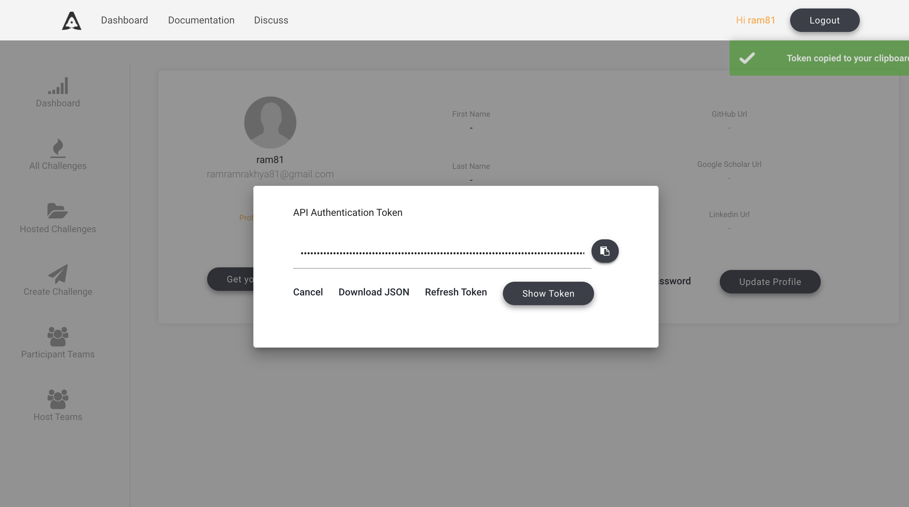
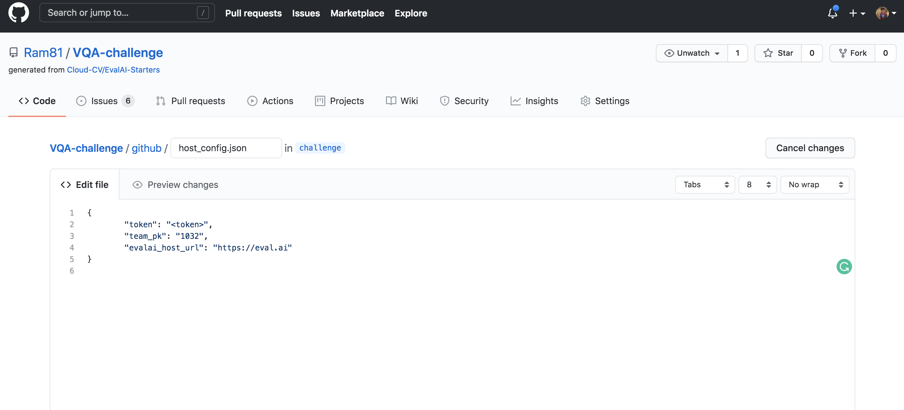
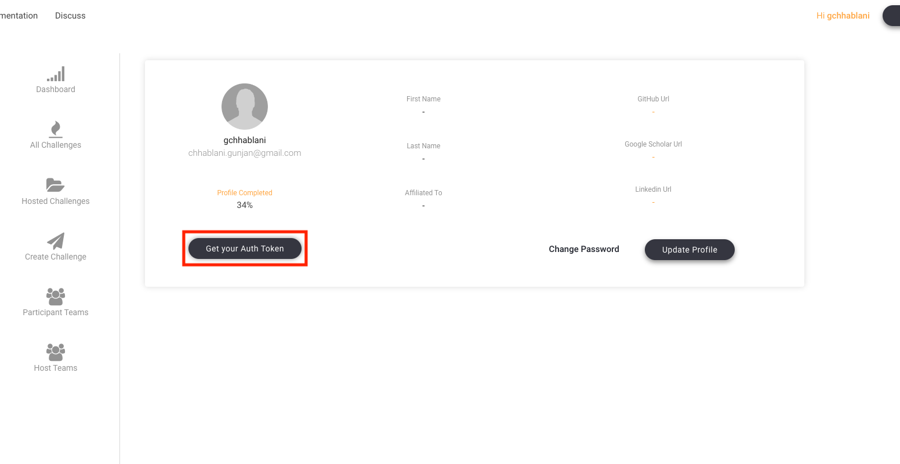
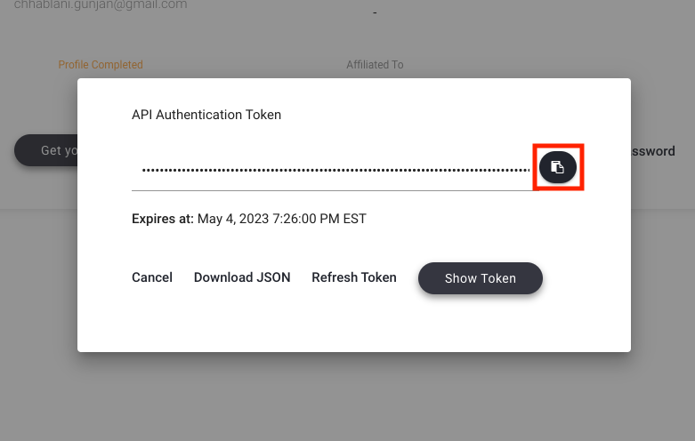

# Host challenge

EvalAI supports hosting challenges with different configurations. Challenge organizers can choose to customize most aspects of the challenge but not limited to:

- Evaluation metrics
- Language/Framework to implement the metric
- Number of phases and data-splits
- Daily / monthly / overall submission limit
- Number of workers evaluating submissions
- Evaluation on remote machines
- Provide your AWS credentials to host code upload based challenge
- Show / hide error bars on leaderboard
- Public / private leaderboards
- Allow / block certain email addresses to participate in the challenge or phase
- Choose which fields to export while downloading challenge submissions

We have hosted challenges from different domains such as:

- Machine learning ([2019 SIOP Machine Learning Competition](https://eval.ai/web/challenges/challenge-page/160/leaderboard/481))
- Deep learning ([Visual Dialog Challenge 2019 ](https://eval.ai/web/challenges/challenge-page/161/leaderboard/483))
- Computer vision ([Vision and Language Navigation](https://eval.ai/web/challenges/challenge-page/97/leaderboard/270))
- Natural language processing ([VQA Challenge 2019](https://eval.ai/web/challenges/challenge-page/163/leaderboard/498))
- Healthcare ([fastMRI Image Reconstruction ](https://eval.ai/web/challenges/challenge-page/153/leaderboard/447))
- Self-driving cars ([CARLA Autonomous Driving Challenge](https://eval.ai/web/challenges/challenge-page/246/leaderboard/817))

We categorize the challenges in two categories:

1. **Prediction upload based challenges**: Participants upload predictions corresponding to ground truth labels in the form of a file (could be any format: `json`, `npy`, `csv`, `txt` etc.)

   Some of the popular prediction upload based challenges that we have hosted are shown below:

   <a href="https://eval.ai/web/challenges/list" target="_blank"></a><br />

   If you are interested in hosting prediction upload based challenges, then [click here](host_challenge.html#host-prediction-upload-based-challenge).

    <br />

2. **Code upload based challenges**: In these kind of challenges, participants upload their training code in the form of docker images using [EvalAI-CLI].

   Some of the popular code upload based challenges that we have hosted are shown below:

   <a href="https://eval.ai/web/challenges/list" target="_blank"></a>

   If you are interested in hosting code upload based challenges, then [click here](host_challenge.html#host-prediction-upload-based-challenge).

## Host challenge using github

### Step 1: Use template

Use [EvalAI-Starters](https://github.com/Cloud-CV/EvalAI-Starters) template. See [this](https://docs.github.com/en/free-pro-team@latest/github/creating-cloning-and-archiving-repositories/creating-a-repository-from-a-template) on how to use a repository as template.

   <br />
   <br />

### Step 2: Generate github token

Generate your [github personal acccess token](https://docs.github.com/en/free-pro-team@latest/github/authenticating-to-github/creating-a-personal-access-token) and copy it in clipboard.

Add the github personal access token in the forked repository's [secrets](https://docs.github.com/en/free-pro-team@latest/actions/reference/encrypted-secrets#creating-encrypted-secrets-for-a-repository) with the name `AUTH_TOKEN`.

### Step 3: Setup host configuration

Now, go to [EvalAI](https://eval.ai) to fetch the following details -
   1. `evalai_user_auth_token` - Go to [profile page](https://eval.ai/web/profile) after logging in and click on `Get your Auth Token` to copy your auth token.
   2. `host_team_pk` - Go to [host team page](https://eval.ai/web/challenge-host-teams) and copy the `ID` for the team you want to use for challenge creation.
   3. `evalai_host_url` - Use `https://eval.ai` for production server and `https://staging.eval.ai` for staging server.

   <br />

### Step 4: Setup automated update push

Create a branch with name `challenge` in the forked repository from the `master` branch.
<span style="color:purple">Note: Only changes in `challenge` branch will be synchronized with challenge on EvalAI.</span>

Add `evalai_user_auth_token` and `host_team_pk` in `github/host_config.json`.
   <br />

### Step 5: Update challenge details

Read [EvalAI challenge creation documentation](https://evalai.readthedocs.io/en/latest/configuration.html) to know more about how you want to structure your challenge. Once you are ready, start making changes in the yaml file, HTML templates, evaluation script according to your need.

### Step 6: Push changes to the challenge

Commit the changes and push the `challenge` branch in the repository and wait for the build to complete. View the [logs of your build](https://docs.github.com/en/free-pro-team@latest/actions/managing-workflow-runs/using-workflow-run-logs#viewing-logs-to-diagnose-failures).
    <br />
    <br />

If challenge config contains errors then a `issue` will be opened automatically in the repository with the errors otherwise the challenge will be created on EvalAI.

### Step 7: Verify challenge

Go to [Hosted Challenges](https://eval.ai/web/hosted-challenges) to view your challenge. The challenge will be publicly available once EvalAI admin approves the challenge.

To update the challenge on EvalAI, make changes in the repository and push on `challenge` branch and wait for the build to complete.

## Host Prediction upload based challenge

### Step 1: Setup challenge configuration

We have created a sample challenge configuration that we recommend you to use to get started. Use [EvalAI-Starters](https://github.com/Cloud-CV/EvalAI-Starters) template to start. See [this](https://docs.github.com/en/free-pro-team@latest/github/creating-cloning-and-archiving-repositories/creating-a-repository-from-a-template) on how to use a repository as template.

### Step 2: Edit challenge configuration

Open [`challenge_config.yml`](https://github.com/Cloud-CV/EvalAI-Starters/blob/master/challenge_config.yaml) from the repository that you cloned in step-1. This file defines all the different settings of your challenge such as start date, end date, number of phases, and submission limits etc.

Edit this file based on your requirement. For reference to the fields, refer to the [challenge configuration reference section](configuration.html).

### Step 3: Edit evaluation script

Next step is to edit the challenge evaluation script that decides what metrics the submissions are going to be evaluated on for different phases.

Please refer to the [writing evaluation script](evaluation_scripts.html) to complete this step.

### Step 4: Edit challenge HTML templates

Almost there. You just need to update the HTML templates in the `templates/` directory of the bundle that you cloned.

EvalAI supports all kinds of HTML tags which means you can add images, videos, tables etc. Moreover, you can add inline CSS to add custom styling to your challenge details.
<!-- 
### Step 5: Upload configuration on EvalAI

Finally run the `./run.sh` script in the bundle. It will generate a `challenge_config.zip` file that contains all the details related to the challenge. Now, visit [EvalAI - Host challenge page](https://eval.ai/web/challenge-host-teams) and select/create a challenge host team. Then upload the `challenge_config.zip`. -->

**Congratulations!** you have submitted your challenge configuration for review and [EvalAI team](https://eval.ai/team) has notified about this. [EvalAI team](https://eval.ai/team) will review and will approve the challenge.

If you have issues in creating a challenge on EvalAI, please feel free to contact us at [team@cloudcv.org](mailto:team@cloudcv.org) create an issue on our [GitHub issues page](https://github.com/Cloud-CV/EvalAI/issues/new).

## Host Code upload based challenge

### Step 1: Setup challenge configuration

Steps to create a Code upload based challenge is very similar to what it takes to create a [prediction upload based challenge](host_challenge.html#host-a-prediction-upload-based-challenge).

We have created a sample challenge configuration that we recommend you to use to get started. Use [EvalAI-Starters](https://github.com/Cloud-CV/EvalAI-Starters) template to start. See [this](https://docs.github.com/en/free-pro-team@latest/github/creating-cloning-and-archiving-repositories/creating-a-repository-from-a-template) on how to use a repository as template.

### Step 2: Edit challenge configuration

Open [`challenge_config.yml`](https://github.com/Cloud-CV/EvalAI-Starters/blob/master/challenge_config.yaml) from the repository that you cloned in step-1. This file defines all the different settings of your challenge such as start date, end date, number of phases, and submission limits etc. Edit this file based on your requirement.

Make sure that following fields are set correctly:

- `remote_evaluation` is set to `True`
- `is_docker_based` is set to `True`

For reference to the fields, refer to the [challenge configuration reference section](configuration.html).

### Step 3: Edit evaluation script

Next step is to edit the challenge evaluation script that decides what metrics the submissions are going to be evaluated on for different phases.

Please refer to the [writing evaluation script](evaluation_scripts.html) to complete this step.

### Step 4: Edit challenge HTML templates

Almost there. You just need to update the HTML templates in the `templates/` directory of the bundle that you cloned.

EvalAI supports all kinds of HTML tags which means you can add images, videos, tables etc. Moreover, you can add inline CSS to add custom styling to your challenge details.

<!-- ### Step 5: Upload configuration on EvalAI

Finally run the `./run.sh` script in the bundle. It will generate a `challenge_config.zip` file that contains all the details related to the challenge. Now, visit [EvalAI - Host challenge page](https://eval.ai/web/challenge-host-teams) and select/create a challenge host team. Then upload the `challenge_config.zip`. -->

**Congratulations!** you have submitted your challenge configuration for review and [EvalAI team](https://eval.ai/team) has notified about this. [EvalAI team](https://eval.ai/team) will review and will approve the challenge.

## Host a challenge with remote evalution

The steps related to challenge creation will be similar to the steps mentioned above for different types of challenges. This section specifically deals with the bits and pieces required to set up remote challenge evaluation on your own instances.

### Step 1: Modify challenge configuration

Set the `remote_evaluation` parameter to `True` in [`challenge_config.yaml`](https://github.com/Cloud-CV/EvalAI-Starters/blob/621f0cb37b2f1951613c9b6c967ce35be55d34c8/challenge_config.yaml#L12). The `challenge_config.yaml` file defines all the different settings of a challenge and you can edit other things based on your requirement.

Make sure that following fields are set correctly:

- `remote_evaluation` is set to `True`

This will ensure that the challenge worker is aware that the evaluation is to be performed remotely.

### Step 2: Fetch details for the challenge

Now, go to [EvalAI](https://eval.ai) to fetch the following details -

1. `auth_token` - Login -> Go to [profile page](https://eval.ai/web/profile) -> Click on `Get your Auth Token` -> Click on the Copy button. The auth token will get copied to your clipboard.
2. `evalai_api_server` - Use `https://eval.ai` for production server and `https://staging.eval.ai` for staging server

<br />
<br />

After you are done with Step 4 from [here](#step-4-setup-automated-update-push), the challenge should be up on EvalAI. Then, you can go to `Manage Tab` and fetch the following:

3. `queue_name`: The queue name for the worker which will be used to receive submissions from participants.
4. `challenge_pk`: The primary key for the challenge.

<br />

### Step 3: Edit remote evaluation script

Next step is to edit the challenge evaluation script that decides what metrics the submissions are going to be evaluated on for different phases. The evaluation script template is different for the remote evaluation and can be found here: [Remote Challenge Evaluation Script](https://github.com/Cloud-CV/EvalAI-Starters/blob/master/remote_challenge_evaluation/evaluation_script_starter.py).

This script is expected the submissions from our queues and updates the status of the submission in our database accordingly. When the submission is finished, 

1. Add the details fetched in the previous step in [these lines](https://github.com/Cloud-CV/EvalAI-Starters/blob/621f0cb37b2f1951613c9b6c967ce35be55d34c8/remote_challenge_evaluation/evaluation_script_starter.py#L148-L151) inside `__main__`.

2. Modify the evaluation script, especially [these lines](https://github.com/Cloud-CV/EvalAI-Starters/blob/621f0cb37b2f1951613c9b6c967ce35be55d34c8/remote_challenge_evaluation/evaluation_script_starter.py#L176-L183):

   ```python
   elif submission.get("status") == "running":
         # This section is meant to handle what is to be done when the status is running.
         # If the evaluation is still running, you could check for the current status, whether it passed, or failed, or is still running.

         # To update the EvalAI submission status:
         # Update EvalAI after calculating final set of metrics and set submission status as "FINISHED"
         # submission_data = {
         #   "challenge_phase": "<phase_pk>",
         #   "submission": "<submission_pk>",
         #   "stdout": "",
         #   "stderr": "",
         #   "submission_status": "FINISHED",
         #   "result": '[{"split": "<split-name>", "show_to_participant": true,"accuracies": {"Metric1": 80,"Metric2": 60,"Metric3": 60,"Total": 10}}]',
         #   "metadata": "",
         # }
         # update_data = evalai.update_submission_data(submission_data)

         # OR

         # Update EvalAI in case of errors and set submission status as "FAILED"
         # submission_data = {
         #     "challenge_phase": "<phase_pk>",
         #     "submission": "<submission_pk>",
         #     "stdout": "",
         #     "stderr": "<ERROR FROM SUBMISSION>",
         #     "submission_status": "FAILED",
         #     "metadata": "",
         # }
         # update_data = evalai.update_submission_data(submission_data)
         pass


   else:
         # This section is meant to handle the "submitted" status. When the submission is submitted, you want to download the code and change the status to running when the submission is running.
         
         # Write code to download the input file from the submission from the submission.input_file.url
         
         # Run the submission with the input file using your own code and data.
         # Update EvalAI right after sending the submission into "RUNNING" state.

         # status_data = {"submission": "", "job_name": "", "submission_status": "RUNNING"}
         # update_status = evalai.update_submission_status(status_data)         
         pass

### Step 4: Configure your instance to run the evaluation script

1. Create a python or conda virtual environment.
2. Install the worker requirements from the `EvalAI-Starters/remote_challenge_evaluation` present [here](https://github.com/Cloud-CV/EvalAI-Starters/blob/master/remote_challenge_evaluation/requirements.txt).
3. Run the worker using `python -m evaluation_script_starter`.

If you have issues in creating a challenge on EvalAI, please feel free to contact us at [team@cloudcv.org](mailto:team@cloudcv.org) create an issue on our [GitHub issues page](https://github.com/Cloud-CV/EvalAI/issues/new).

[evalai-starters]: https://github.com/Cloud-CV/EvalAI-Starters
[evalai-cli]: https://cli.eval.ai/
[evalai]: http://eval.ai
[docker-compose]: https://docs.docker.com/compose/install/
[docker]: https://docs.docker.com/install/linux/docker-ce/ubuntu/
