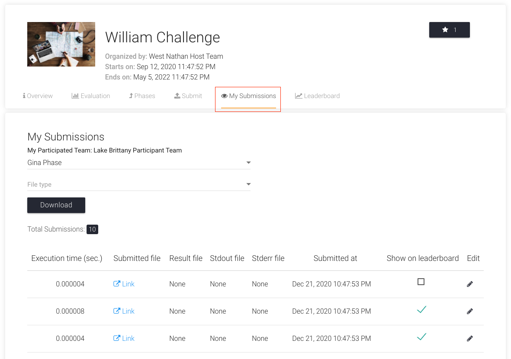
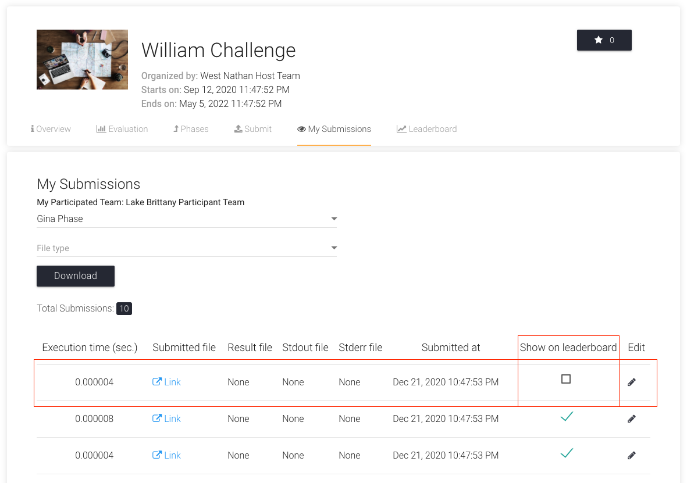
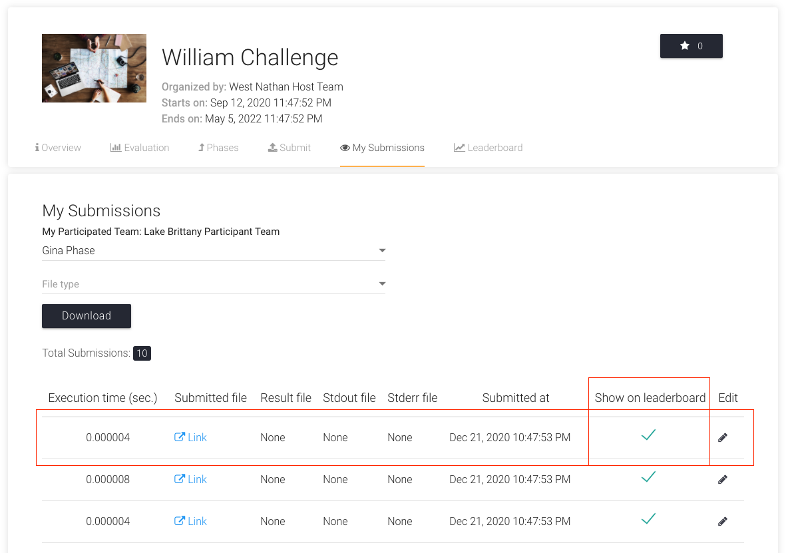

## Make Submission Public

Let's assume that you want to make your latest submission public in `William Challenge`.

1. Go to `My Submissions` Tab of the challenge page, select the phase and scroll horizontally.
   

2. Now, to make the first submission public, click on the checkbox under the column `Show on Leaderboard`. It will turn into a green checkmark.
   
   

## Make Submission Private

Let's assume that you want to make your latest submission private in `William Challenge`.

1. Go to `My Submissions` Tab of the challenge page, select the phase and scroll horizontally.
   

2. Now, to make the first submission private, click on the green checkmark under the column `Show on Leaderboard`. It will turn into a black checkbox.
   
   
   
## Make Submission Baseline

Let's assume that you want to make your latest submission baseline in `William Challenge`.
1. Go to `My Submissions` Tab of the challenge page, select the phase and scroll horizontally.
   
2. Select the submission you want to make as the baseline one (The submission should be Public).
3. Add this piece of documentation in the announcement feature
   "Dear Participants,
   We’re excited to share the baseline submission for this challenge. This submission demonstrates the expected minimum performance level. It has been made public and is visible on the leaderboard under Submission ID [ID or Name].

   Aim to surpass this baseline for higher rankings. Visit the leaderboard to view the metrics.

   Happy coding,
   Challenge Host Team "
  

If you face any issues, please feel free to create an issue on our [GitHub Issues Page](https://github.com/Cloud-CV/EvalAI/issues/new).
