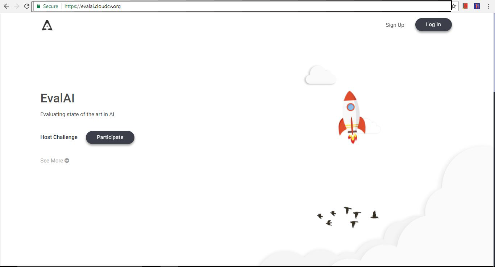
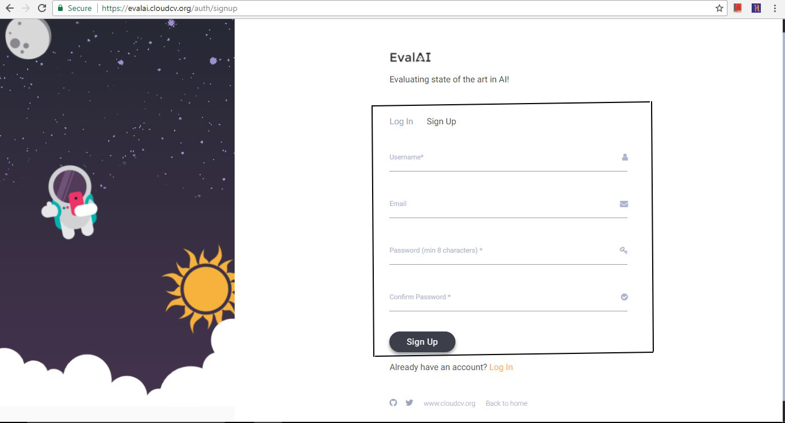
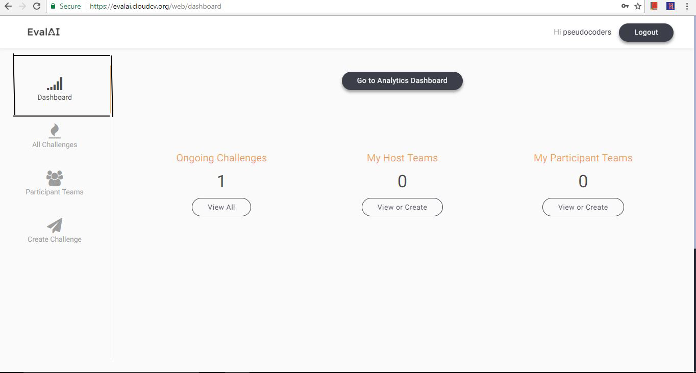
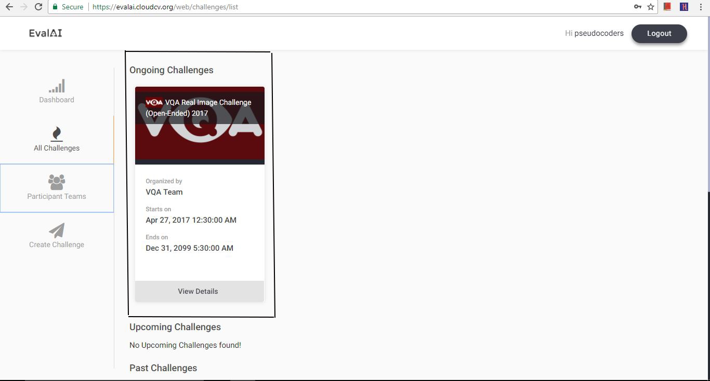
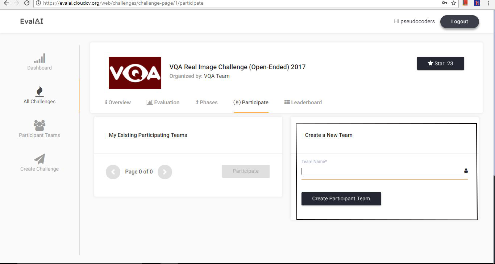
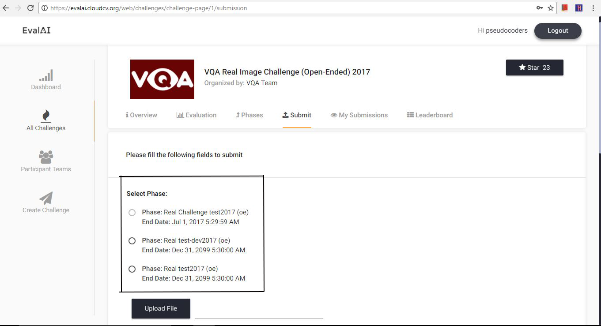

# Participate in a challenge

You have to create an account on [EvalAI](http://eval.ai) and a participant team in order to participate in a challenge.

If you are already familiar with the flow of EvalAI, you may want to skip this section else please follow the following steps to participate in a challenge (VQA Challenge 2017 in this example):

### 1. Visit eval.ai

Open [EvalAI website](https://eval.ai/).

### 2. Sign up or Log in

Sign Up and fill in your credentials or log in if you have already registered.

After signing up you would be on the dashboard page.

### 3. Choose challenge

Then, go to challenges section and choose an active challenge.

### 4. Challenge Page

After reading the challenge instructions on the challenge page, you can participate in the challenge.

### 5. Create Participant Team

Create a participant team if there isn't any or you can select from the existing ones.

Click on 'Participate' tab after selecting a team.

**Tada!** you have successfully participated in a challenge.
